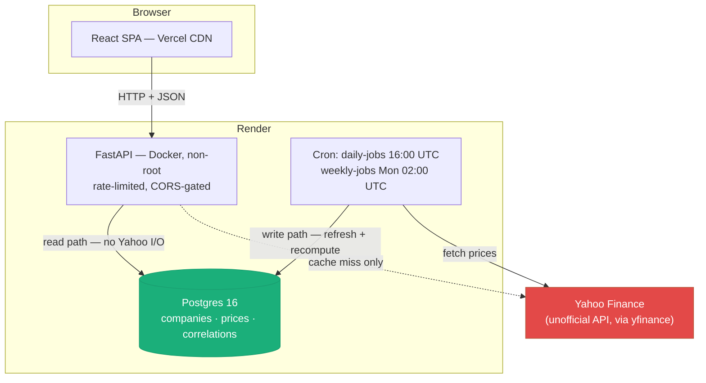
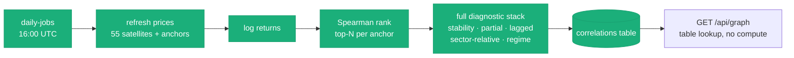

# Stock Correlation Dependency Tracker — Overview

> **Start here.** This is the front door to the documentation: what the app is, what it does, how
> it's put together, and the design decisions that actually shaped the code. Every other document
> in `docs/` goes deeper on one slice — §7 is the map.
>
> Verified against the source and the deployed services, not written from memory. Where an older
> document contradicts this one, §7 says which is stale.

---

## 1. What this is

A tool that takes large-cap **anchor** stocks (NVDA, AAPL, TSM, ASML) and discovers smaller
**satellite** stocks whose daily price movements are statistically correlated with each anchor —
then renders the result as an explorable, weighted dependency graph.

The question it answers: *"If NVIDIA moves, what else moves with it — and how reliably?"*

The honest framing, which the app states in its own UI: these are **price-correlation
relationships, not verified supply-chain dependencies**. A correlation of 0.85 between NVDA and a
small optics supplier is evidence that the two co-move; it is not proof that one depends on the
other. Everything in the product is built to make that distinction visible rather than paper over it
— which is why a raw correlation is never shown without a stability score beside it.

**Status:** deployed and running. Backend on Render, frontend on Vercel, managed Postgres,
GitHub Actions gating every PR. Roadmap Phases 1–4 plus the layered-backend refactor (4.5),
containerization (4.7), Postgres (4.8), CI/CD (4.9), and Track A Phases 1–3 (precomputed
correlations, scheduled jobs, portfolio analysis) are all shipped. 237 backend tests, 7 frontend
test suites.

---

## 2. What it does

Four views, each answering a different question.

| Route | View | Question it answers |
|---|---|---|
| `/` | **Dashboard** | *What does the whole dependency network look like?* Interactive force-directed graph across all anchors, plus a sortable satellite table. |
| `/anchor/:ticker` | **Anchor detail** | *What is correlated with this one anchor, and how much do I trust each edge?* The full diagnostic stack per satellite. |
| `/relatedness` | **Relatedness heatmap** | *How related are the anchors to each other?* Inferred from shared satellites, not direct price correlation. |
| `/portfolio` | **Portfolio analysis** | *Of the variance in my portfolio, how much is driven by each anchor?* Paste holdings, get a variance decomposition, concentration metrics, and a plain-language risk read-out. |

### The diagnostics behind every edge

A satellite doesn't earn a place in the graph on raw correlation alone. Each edge carries:

| Diagnostic | What it catches |
|---|---|
| **Spearman correlation** (primary ranking) | Rank-based, so one 30% M&A-rumour day can't manufacture a relationship |
| **Pearson correlation** (reported alongside) | The interpretable number, on the same log-returns |
| **Stability score** | A satellite that's 0.85 over the year but swings 0.3–0.95 in rolling 60-day windows is *less* reliable than a steady 0.75 |
| **Partial correlation** vs `^GSPC` | Strips market beta — "both of these follow the S&P" is not a dependency |
| **Sector-relative correlation** | Same idea at sector granularity: co-movement beyond "both track SOXX" |
| **Best lag (1–3 days)** | Does the satellite move *after* the anchor? A lead-lag relationship is predictive; a same-day echo isn't |
| **Regime break** | Has the relationship that held all year quietly stopped holding this month? |

Those seven columns exist because **a single correlation number is not a finding**. Each one is a
different way for a spurious correlation to fail to survive scrutiny.

---

## 3. Architecture at a glance

A monorepo with two independently runnable halves talking over REST/JSON.

| Half | Stack | Runs as |
|---|---|---|
| **Backend** (`src/`) | Python, FastAPI, pandas/numpy/scipy, networkx, SQLAlchemy, yfinance | `uvicorn src.api.main:app` — plus a CLI sharing the same services |
| **Frontend** (`frontend/`) | Vite, React 19, TypeScript, Tailwind v4, TanStack Query + Table | Static SPA build |



### The layers

```
config.yaml ─> src/config.py            pydantic-validated settings
                     │
  src/data/          ├─ fetcher · universe · storage     yfinance + parquet
  src/repositories/  ├─ Protocol interfaces              THE SEAM (§5.1)
                     │    ├─ yfinance_*_repository.py
                     │    └─ postgres/*_repository.py
  src/analysis/      ├─ returns · correlation · ranking · portfolio    PURE MATHS
  src/graph/         ├─ builder · queries                networkx
  src/domain/        ├─ models.py                        pydantic, framework-agnostic
  src/services/      ├─ Price · Company · Correlation · Graph · Portfolio
                     │
  src/api/  ─────────┴─ FastAPI routers + schemas        HTTP only
  src/cli.py ────────── phases 1-4, backfill, scheduled jobs
```

Dependencies point **inward and downward only**. `src/analysis/` imports nothing from services,
repositories, or FastAPI — it takes DataFrames and returns DataFrames. That's what makes 237 tests
runnable without a database, a network, or an HTTP client.

---

## 4. How a number gets made

Two pipelines, deliberately different, for two different questions.

### The graph pipeline — precomputed nightly, served from Postgres



The expensive part runs once a day against a known universe. The request path is a query.

### The portfolio pipeline — computed live, on demand

A pasted portfolio is arbitrary large-cap tickers that the curated satellite universe doesn't
cover, so the precomputed table would miss nearly every row — and the rows it *did* hit would be
Spearman figures mixed into a Pearson variance decomposition, which isn't coherent. So this path
fetches prices for `holdings + anchors` in one call (warm from Postgres) and computes everything
the same way, in-request.

**Two different answers to "should this be precomputed?" for two genuinely different workloads** —
covered in [correlation-mechanism.md](backend_docs/correlation-mechanism.md) and
[track-a-phase-3-portfolio-analysis.md](progress_impl_docs/track-a-phase-3-portfolio-analysis.md) §3.

---

## 5. Key design decisions, and why

### 5.1 Repository `Protocol`s were written before there was a database ⭐

`src/repositories/base.py` defines `PriceRepository`, `CompanyRepository`, and
`CorrelationRepository` as **structural `Protocol`s, not ABCs**. Every service type-hints the
Protocol; no service ever imports a concrete class.

**Why it mattered:** the entire Postgres cutover — swapping parquet-and-yfinance for a real database
— was a conditional in *one file* (`src/api/deps.py`): if `DATABASE_URL` is set, build the Postgres
repositories. No service, router, schema, or test changed. This is the single highest-leverage
decision in the codebase, and it was made months before it paid off.

**Why `Protocol` over `ABC`:** structural typing means an implementation doesn't have to inherit
from anything to satisfy the contract, so test fakes are plain classes with the right methods.

### 5.2 Postgres is a durable cache, not a new data vendor

Yahoo Finance stays the source of truth for prices. Postgres stores what was fetched, with
`fetched_at` TTL columns driving refresh.

**Why:** it keeps one code path. `PostgresPriceRepository` on a cache miss calls the exact same
`fetch_price_history` the yfinance repository does — same validation, same cache semantics, just
durably upserted. There is no "Postgres mode" versus "yfinance mode" divergence to reason about,
and no risk of the two paths producing different numbers.

The consequence worth knowing: a cold start reads warm rows from the database instead of
re-downloading the universe from Yahoo, which is what made the free-tier spin-down tolerable.

### 5.3 Write/read separation — precompute on a schedule, serve from a table

`GET /api/graph` used to run the full seven-diagnostic stack live, per anchor, per request. Now the
daily cron computes it and upserts a snapshot; the endpoint reads.

**Why:** it decouples the two things that were fighting. The analytics can get *more* expensive
without touching request latency, and the request path can't be slowed down by a Yahoo outage.
`force_refresh=true` still exists as an escape hatch that bypasses the table — the live path didn't
get deleted, it got demoted.

### 5.4 Maths in `analysis/`, orchestration in `services/`, HTTP in `api/`

Every formula is a pure function over DataFrames. `src/analysis/portfolio.py` has no imports from
services, repositories, config, or FastAPI.

**Why:** the maths is the part most likely to be wrong and most expensive to debug through an HTTP
client. 19 of the portfolio tests are pure arithmetic with hand-computed expected values — no
fixtures, no mocks, no database. When a variance decomposition is off, the failing test points at
the formula, not at four layers of plumbing.

### 5.5 Log returns, pairwise inner-join, and a minimum-overlap floor

Three rules applied everywhere, without exception:

- **Log returns, not percentage returns** — they're additive over time and symmetric in a way simple
  returns aren't, which matters for anything summed or windowed.
- **Inner-join each pair on its own dates** before correlating. Exchanges have different holiday
  calendars; ASML and NVDA don't trade on the same days. Correlating misaligned series silently
  produces a number that means nothing.
- **`MIN_OVERLAP_DAYS = 30`** — below that, refuse to produce a correlation rather than produce a
  confident-looking one from 11 data points.

The third is the one that shows up in the product: unresolvable holdings come back in an
`unresolved[]` list with a reason, and the UI shows them. **A dropped row silently changes every
percentage on the screen**, so nothing is dropped silently.

### 5.6 Spearman ranks, Pearson explains

Phase 4 ranks satellites by **Spearman** but reports **Pearson** alongside.

**Why:** a small-cap satellite gapping 30% on an acquisition rumour can dominate a Pearson
correlation over 250 days. Spearman correlates ranks, so no single day can. But Spearman is harder
to interpret ("0.72 of rank agreement" means little to a reader), so the interpretable number is
shown too. Ranking and explaining are different jobs; one metric doesn't have to do both.

### 5.7 Market-beta contamination is treated as a first-class problem

Partial correlation against `^GSPC` and sector-relative correlation against sector ETFs both exist
because **in a bull market almost everything correlates with almost everything**. A 0.7
anchor–satellite correlation where both legs are 0.65 correlated with the S&P is mostly just "the
market went up." Reporting it as a dependency would be the single most likely way for this app to be
confidently wrong.

### 5.8 The CLI and the API are siblings, not layers

`python -m src.cli phase1..phase4` and the REST API drive the **same service objects**. The CLI
additionally renders static PNG / interactive HTML artifacts; the API never touches
`src/visualisation/`.

**Why:** the four original `run_phaseN.py` scripts had byte-identical fetch-and-validate blocks
copy-pasted between them. Collapsing them onto shared services removed the duplication *and* meant
the scheduled jobs (`daily-jobs`, `weekly-jobs`) were nearly free to add later — they're CLI
subcommands calling the same services the API calls, running in the same Docker image with an
overridden command.

### 5.9 Portfolio holdings are never persisted, and never travel in a URL

`POST /api/portfolio/analyze` is a POST despite being a pure read, and nothing about the request is
stored.

**Why:** holdings are the most sensitive data the app touches. A query string lands in server access
logs, browser history, and referrer headers; a POST body doesn't. Not persisting means "paste it,
read it, refresh and it's gone" is a real privacy property rather than a promise. It's also rate
limited to 20/min — stricter than the 60/min default — because it's the one endpoint a user can
point at arbitrary symbols, making it the easiest way to drive uncached Yahoo traffic.

### 5.10 Domain models are separate from ORM models

`src/domain/models.py` (pydantic, framework-agnostic) and `src/repositories/postgres/models.py`
(SQLAlchemy) describe overlapping data and are deliberately not shared. Rows translate at the
repository boundary only.

**Why:** it keeps SQLAlchemy out of the service layer and the API contract. The alternative — one
model class serving as ORM row, domain object, and response schema — couples the database schema to
the public API, so a column rename becomes a breaking API change.

### 5.11 Migrate before deploy, enforced structurally

`render.yaml` sets `autoDeploy: false`. GitHub Actions' `cd.yml` builds the image, runs
`alembic upgrade head`, *then* fires Render's deploy hook.

**Why:** Render's own auto-deploy fires the moment it sees a commit, with no way to make it wait for
migrations. That's a race — new code against an un-migrated schema. Turning auto-deploy off makes
`cd.yml` the only thing that can trigger a deploy, so the ordering is guaranteed rather than hoped
for.

### 5.12 Real Postgres in CI, not mocks

**Why, concretely:** Postgres caps bound parameters at 65,535 per statement. A full price backfill
binds four per row and blows straight past it. That bug is **invisible to a mocked session** — it
only exists in the real driver. CI runs against a real Postgres 16 service container, which is why
`_UPSERT_BATCH_SIZE = 2000` exists in the code instead of in a production incident.

### 5.13 The satellite universe is a hardcoded 55-ticker list, on purpose (for now)

**Why:** a dynamic screener is Phase 7. Until then, a curated list is reproducible, has no
survivorship-bias surprises introduced by a screener's own filters, and keeps the Yahoo request
volume predictable. It is the largest piece of accepted debt in the project and is documented as
such in [universe-roadmap.md](backend_docs/universe-roadmap.md).

---

## 6. Where the code lives

| Path | What's in it |
|---|---|
| `src/config.py` | pydantic-validated `config.yaml` + env settings |
| `src/data/` | yfinance fetching (TTL cache, threaded metadata), universe list, parquet storage |
| `src/repositories/` | `Protocol` interfaces + yfinance and Postgres implementations (§5.1) |
| `src/analysis/` | `returns` · `correlation` (7 diagnostics) · `ranking` · `portfolio` — pure functions |
| `src/graph/` | networkx construction, traversal queries, JSON serialization |
| `src/domain/` | pydantic models shared by services and API; NaN/inf-safe serialization |
| `src/services/` | Price · Company · Correlation · Graph · Portfolio — business logic |
| `src/api/` | FastAPI app, 9 routes, response schemas, rate limiting, error mapping |
| `src/cli.py` | `phase1`–`phase4`, `backfill-postgres`, `daily-jobs`, `weekly-jobs` |
| `src/visualisation/` | matplotlib static plots, pyvis interactive HTML (CLI only) |
| `frontend/src/pages/` | 4 routes: Dashboard, AnchorDetail, Relatedness, Portfolio |
| `frontend/src/api/` | typed client generated from the OpenAPI schema + TanStack Query hooks |
| `tests/` | 237 tests mirroring the source layout |
| `alembic/`, `render.yaml`, `Dockerfile`, `.github/workflows/` | schema migrations, infra-as-code, CI/CD |

### The API surface

```
GET  /api/health
GET  /api/graph                          weighted multi-anchor graph (node-link JSON)
GET  /api/graph/relatedness              anchor x anchor matrix from shared satellites
GET  /api/companies                      satellite universe
GET  /api/companies/{ticker}             profile + valuation ratios
GET  /api/companies/{ticker}/correlations  ranked satellites + full diagnostics
POST /api/companies/{ticker}/refresh     force recompute, bypassing the snapshot
GET  /api/prices/{ticker}                price history
POST /api/portfolio/analyze              variance decomposition (§5.9)
```

---

## 7. Document map

| Document | Read it for | Health |
|---|---|---|
| **This file** | Orientation, architecture, design rationale | Current |
| [prod_roadmap/current-architecture.md](prod_roadmap/current-architecture.md) | Exhaustive code-grounded detail: every module, every hardcoded value | ⚠️ §1 says "nothing is deployed" — **stale**; everything else holds |
| [prod_roadmap/target-architecture.md](prod_roadmap/target-architecture.md) | The end-state design being built toward | Current |
| [prod_roadmap/production-roadmap.md](prod_roadmap/production-roadmap.md) | The phase-by-phase productionization plan | Current |
| [backend_docs/correlation-mechanism.md](backend_docs/correlation-mechanism.md) | How the seven diagnostics actually work | Current |
| [backend_docs/universe-roadmap.md](backend_docs/universe-roadmap.md) | Why the universe is hardcoded and how Phase 7 replaces it | Current |
| [frontend_docs/frontend-roadmap.md](frontend_docs/frontend-roadmap.md), [frontend-build-plan.md](frontend_docs/frontend-build-plan.md) | Frontend design system and view plans | ⚠️ Predates the Portfolio view |
| [progress_impl_docs/what-has-been-built.md](progress_impl_docs/what-has-been-built.md) | The Postgres/CI/CD/Render/Vercel journey, with the bugs hit | ⚠️ §9's gaps list predates Track A — scheduled jobs and precomputed correlations have since shipped |
| [progress_impl_docs/track-a-product-plan.md](progress_impl_docs/track-a-product-plan.md) | The "make it a real product" track, phase by phase | Current |
| [progress_impl_docs/track-a-phase-3-portfolio-analysis.md](progress_impl_docs/track-a-phase-3-portfolio-analysis.md) | How portfolio analysis was built | ⚠️ §4 maths superseded — see below |
| [progress_impl_docs/correlation-engine-buildout.md](progress_impl_docs/correlation-engine-buildout.md) | **Measured defects in the portfolio maths** and the plan to scale past 4 anchors | Current |
| [progress_impl_docs/research-track.md](progress_impl_docs/research-track.md) | Proposed portfolio-correlation research workspace | Proposal |
| [progress_impl_docs/next-steps.md](progress_impl_docs/next-steps.md) | Where the project goes from here, three tracks | Current |
| [../stock_correlation_graph_roadmap.md](../stock_correlation_graph_roadmap.md) | The original design and rationale | Current |

---

## 8. Running it

```bash
# Full local stack (API + Postgres 16)
make up && docker compose exec api alembic upgrade head

# The gate CI enforces
make check                     # ruff + format + mypy + pytest

# One-time: seed universe + price history (safe to re-run; every write upserts)
DATABASE_URL="<external-url>" python -m src.cli backfill-postgres

# CLI artifacts (renders to outputs/)
python -m src.cli phase4

# Frontend
cd frontend && npm run dev / test / test:e2e / build
```

**To ship a change:** branch → PR → `ci.yml` passes → merge → `cd.yml` builds, migrates, deploys.
Direct pushes to `main` are blocked. **To change the schema:** edit the SQLAlchemy models,
`alembic revision --autogenerate`, review the generated file, commit.

---

## 9. Honest status

**What's solid:** the layering and the repository seam (§5.1) have survived a database swap and a
deployment without a rewrite, which is the real test of an abstraction. The correlation diagnostics
are statistically careful in ways that most price-correlation tools aren't. Everything is tested,
gated, and deployed.

**What's known-wrong:** the portfolio variance decomposition has measured defects — most
significantly, its roll-up aggregates variance *shares* rather than exposures, which understates
concentration by up to 50 percentage points on a diversified-looking portfolio. Quantified, with a
fix and a phased plan, in
[correlation-engine-buildout.md](progress_impl_docs/correlation-engine-buildout.md).

**Accepted debt:** the 55-ticker hardcoded universe (§5.13); frontend tests not wired into CI;
no auth (deliberate for a read-only public app); no structured logging or request IDs; free-tier
cold starts visible on first request after idle.

**The largest open design question:** the portfolio feature explains holdings against four anchors,
three of which are semiconductor names. That's a *theme* basis, not a spanning one — a healthcare
portfolio correctly comes back "90% unexplained," which is honest but not useful. Widening it is the
subject of the buildout document, and it is the difference between a demo and a product.
