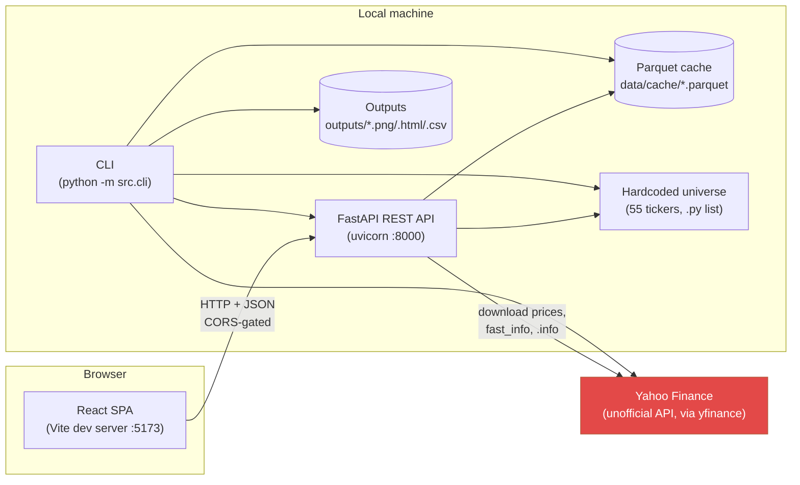
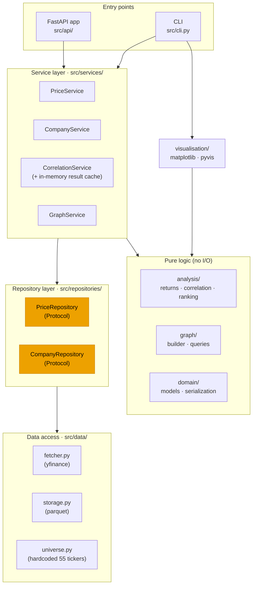
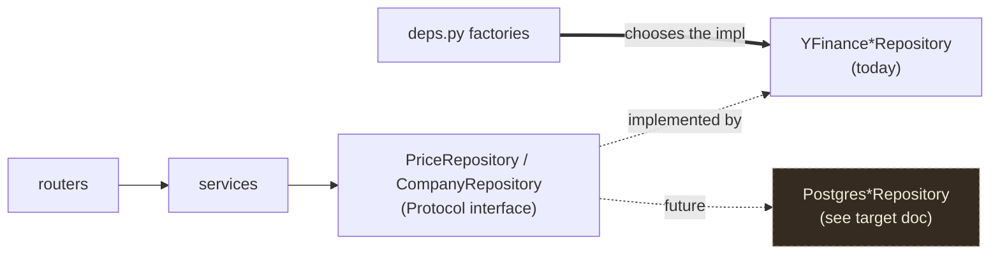
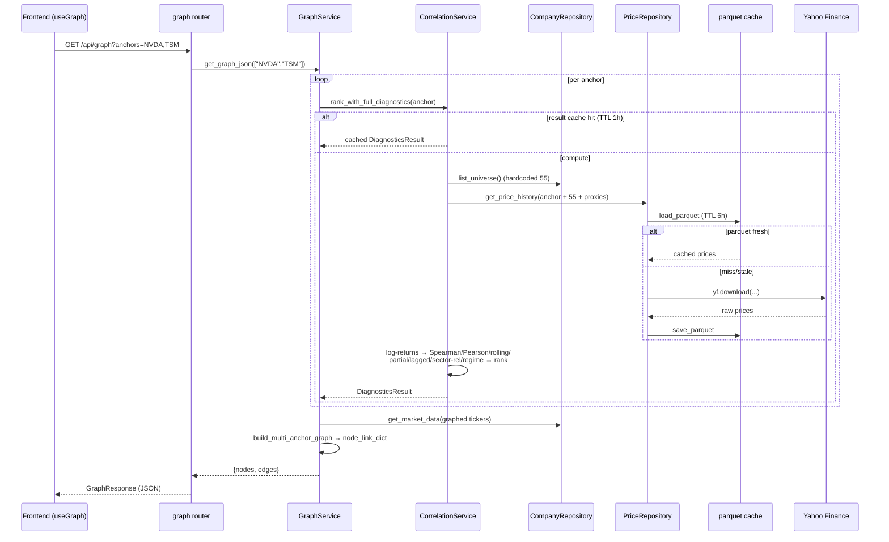
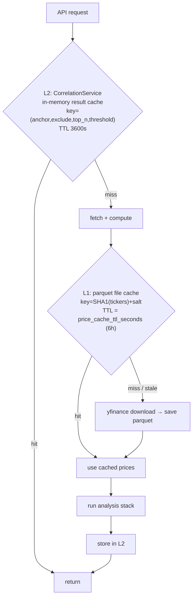
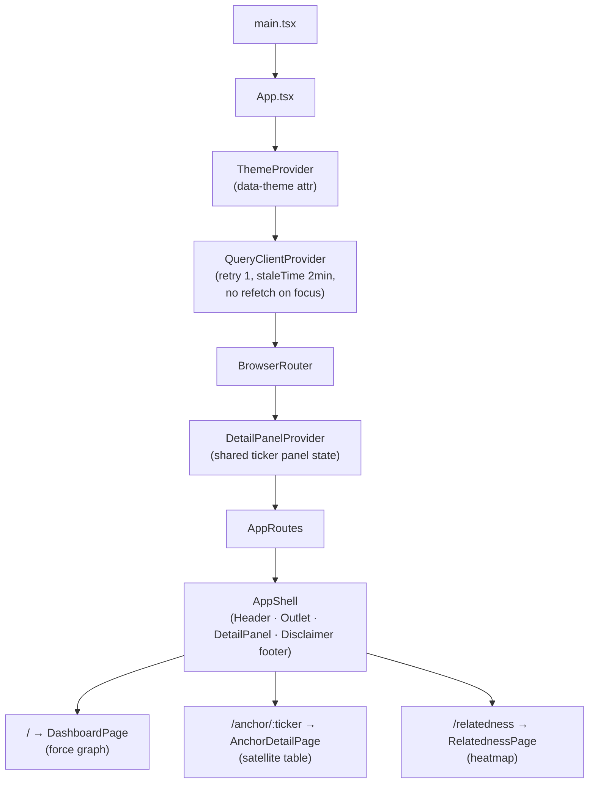
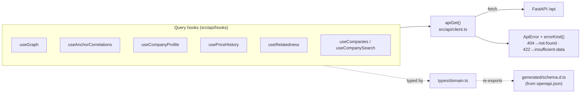

# Current Architecture

> **What this document is.** A precise, code-grounded description of how the Stock
> Correlation Dependency Tracker is built and behaves *today* — the backend, the
> frontend, the API contract between them, every external dependency, and every
> value that is hardcoded. It describes reality, not intent. For where we want to
> take it, see [target-architecture.md](target-architecture.md).
>
> Everything here was verified directly against the source, not assumed. Where the
> code and the prose docs disagree, the code wins and the disagreement is called out.

---

## 1. At a glance

The project is a **monorepo with two independently-runnable halves** that talk over
a REST/JSON HTTP boundary:

| Half | Location | Stack | Runs as |
|---|---|---|---|
| **Backend** | [../../src/](../../src/) | Python 3.9, FastAPI, pandas/numpy/scipy, networkx, yfinance | `uvicorn src.api.main:app` on `:8000` (also a CLI) |
| **Frontend** | [../../frontend/](../../frontend/) | Vite 8, React 19, TypeScript 5.9, Tailwind v4, TanStack Query/Table | `vite` dev server on `:5173` (static SPA) |

The backend discovers, for each large-cap **anchor** stock, the smaller **satellite**
stocks whose daily log-returns are statistically correlated with it, runs a stack of
correlation diagnostics, and assembles a weighted dependency graph. The frontend is a
research dashboard that renders that graph, a sortable diagnostics table, per-ticker
detail panels, and an anchor-relatedness heatmap.

**Deployment status: nothing is deployed.** Both halves run locally. There is no
Docker, no database, no CI, and no hosting. Data lives in on-disk Parquet files and a
hardcoded Python list. This is a locally-complete, pre-production system.



> The CLI and the API are siblings, not layers: both drive the **same service
> objects**. The CLI additionally renders static/interactive artifacts to
> `outputs/`; the API never touches `outputs/` and the visualisation modules.

---

## 2. Repository layout

```
stock_dependency_tracker/
├── config.yaml                 # all runtime parameters (anchors, thresholds, TTLs)
├── pyproject.toml              # installable package "src", backend deps
├── requirements.txt            # duplicate of pyproject deps (pip convenience)
├── pytest.ini                  # test config
│
├── src/                        # ── BACKEND ──
│   ├── config.py               # pydantic Config, loaded from config.yaml
│   ├── errors.py               # DomainError hierarchy (framework-agnostic)
│   ├── cli.py                  # python -m src.cli {phase1..phase4}
│   ├── data/                   # yfinance + parquet + the hardcoded universe
│   ├── repositories/           # Protocol interfaces = the "swap-the-backend" seam
│   ├── domain/                 # framework-agnostic pydantic models + serialization
│   ├── analysis/               # returns, correlation math, ranking (pure functions)
│   ├── graph/                  # NetworkX construction + traversal/serialization
│   ├── services/               # business logic / use-cases
│   ├── api/                    # FastAPI app, DI, routers, schemas, error mapping
│   └── visualisation/          # matplotlib + pyvis renderers (CLI only)
│
├── frontend/                   # ── FRONTEND ──
│   ├── src/
│   │   ├── api/                # typed fetch client, query hooks, generated schema
│   │   ├── components/         # graph, satellite-table, ticker-detail, layout, …
│   │   ├── pages/              # Dashboard, AnchorDetail, Relatedness
│   │   ├── theme/              # ThemeProvider + JS token mirror
│   │   ├── styles/             # globals.css (Tailwind v4 @theme), fonts.css
│   │   └── lib/                # URL-state + responsive hooks
│   ├── openapi.json            # snapshot of the API schema
│   └── .env.development/.production
│
├── data/{raw,processed,cache}/ # parquet cache (cache/ is the only one used)
├── outputs/{graphs,reports}/   # CLI artifacts (PNG/HTML/CSV)
├── tests/                      # 142 backend tests (no frontend tests)
└── docs/                       # this folder tree
```

---

## 3. Backend architecture

### 3.1 The layered model

The backend is a **strict, one-directional dependency stack**. Each layer depends only
on the layer(s) below it and never reaches upward. This is the single most important
architectural fact about the codebase, because it is what makes the storage backend
swappable (see [§3.3](#33-the-repository-seam)).



**Why it's shaped this way.** The project was refactored (documented in
[phase4-5.md](../phase4-5.md)) from four copy-pasted `run_phaseN.py` scripts into this
layered form specifically so that (a) the CLI and a future HTTP API could share one
implementation, and (b) the data source could later move from yfinance/parquet to
Postgres without touching services, routes, schemas, or the frontend. The Protocol
seam (highlighted) is where that swap will happen.

### 3.2 Layer-by-layer walkthrough

#### Config — [src/config.py](../../src/config.py)
A single flat pydantic `Config` model, loaded from `config.yaml` at a **relative path**
(`"config.yaml"`, resolved from the process CWD). There is **no environment-variable
override and no secrets handling** — the config file is the only source of runtime
parameters. `load_config()` is cached (`lru_cache`) in `deps.py` and called directly
inside each DI factory (never passed as an argument to a cached function, because an
unfrozen pydantic model is unhashable).

#### Data access — [src/data/](../../src/data/)
The only code that talks to the outside world for data.

- **[fetcher.py](../../src/data/fetcher.py)** — three yfinance entry points:
  - `fetch_price_history(tickers, lookback_days, …)` — one bulk `yf.download(...)`
    call (`group_by="ticker"`, `auto_adjust=True`, `threads=True`). Detects the
    returned column shape at runtime (`isinstance(raw.columns, pd.MultiIndex)`) rather
    than guessing from ticker count — this was a real bug fixed when the single-ticker
    `/prices/{ticker}` endpoint was first built. Drops tickers with `< MIN_TRADING_DAYS`
    (**30**) of history, logging each drop.
  - `fetch_metadata(tickers, …)` — market cap + 3-month avg volume via
    `yf.Ticker(t).fast_info`, run across a `ThreadPoolExecutor` (max 16 workers) since
    `fast_info` has no batch form.
  - `fetch_company_facts(ticker, …)` — the slow, single-ticker `.info` + income
    statement fetch for valuation ratios (P/E, PEG, P/B, beta, dividend yield, EBIT,
    margins, business summary). Every field defaults to `None` on error so a partial
    profile still renders.
- **[storage.py](../../src/data/storage.py)** — Parquet persistence. `cache_key()` is a
  16-char SHA1 of the sorted ticker set + a salt (`lookback_days`, `"metadata"`,
  `"facts"`). `load_parquet()` honors an optional `max_age_seconds` TTL by comparing the
  file mtime — `None` means never expires.
- **[universe.py](../../src/data/universe.py)** — the **hardcoded 55-ticker satellite
  universe**, a Python list of `(ticker, name, sector)` tuples returned as a DataFrame.
  This is the single largest hardcoded artifact in the system (see [§7](#7-what-is-hardcoded)).

#### The repository seam — [src/repositories/](../../src/repositories/)
Two `typing.Protocol` interfaces ([base.py](../../src/repositories/base.py)):

- `PriceRepository.get_price_history(tickers, lookback_days, force_refresh) -> DataFrame`
- `CompanyRepository.list_universe()` / `.get_market_data(...)` / `.get_company_facts(...)`

The concrete implementations
([yfinance_price_repository.py](../../src/repositories/yfinance_price_repository.py),
[yfinance_company_repository.py](../../src/repositories/yfinance_company_repository.py))
are **thin delegating wrappers** over `src/data/` — all fetch/cache logic stays in
`data/`, so it isn't duplicated. `force_refresh=True` sets the cache max-age to `0` for
that one call. **Structural typing (Protocol, not ABC) is deliberate:** a future
`PostgresPriceRepository` satisfies the contract by shape alone, and only `deps.py`
imports the concrete classes.

#### Domain models — [src/domain/](../../src/domain/)
Framework-agnostic pydantic models ([models.py](../../src/domain/models.py)) shared by
services *and* the API: `PricePoint`, `CompanyProfile`, `RankedSatellite`, `GraphNode`,
`GraphEdge`. They carry no FastAPI/HTTP concepts, so the CLI can use them too.
[serialization.py](../../src/domain/serialization.py)'s `dataframe_to_models()` is the
**one place** NaN/±inf are cleaned to `None` before anything reaches pydantic or JSON —
a fix for a real bug where `DataFrame.where(df.notna(), None)` silently failed to
convert NaN on float64 columns, breaking JSON serialization.

#### Analysis — [src/analysis/](../../src/analysis/)
Pure functions, no I/O, individually unit-tested.

- **[returns.py](../../src/analysis/returns.py)** — `compute_log_returns()`: `log(p / p.shift(1))`.
  Log-returns, not simple percentage returns, is a project-wide convention.
- **[correlation.py](../../src/analysis/correlation.py)** — the engine. Pearson/Spearman
  (`compute_correlations`), rolling correlation + stability score, first-order **partial
  correlation** (market-adjusted, using `^GSPC`), **lagged cross-correlation** (leading
  indicators), **sector-relative correlation** (subtracts a sector ETF), and
  **regime-break detection**. Every pair is inner-joined on its own common dates before
  correlating; pairs with `< MIN_OVERLAP_DAYS` (**30**) overlap are skipped. Holds the
  hardcoded `SECTOR_ETF_MAP` (see [§7](#7-what-is-hardcoded)).
- **[ranking.py](../../src/analysis/ranking.py)** — `rank_top_n()` (threshold filter →
  sort by |correlation| → head N) and generic `attach_metric()` for left-joining any
  per-ticker diagnostic onto the ranked table.

The methodology is documented in depth in
[correlation-mechanism.md](../backend_docs/correlation-mechanism.md).

#### Graph — [src/graph/](../../src/graph/)
- **[builder.py](../../src/graph/builder.py)** — builds a NetworkX star graph per anchor
  (`build_dependency_graph`) and composes per-anchor stars into one combined multi-anchor
  graph (`build_multi_anchor_graph`). A satellite correlated with several anchors keeps
  **one node** but gains an edge to each. Optional diagnostic columns ride along onto
  edges when present.
- **[queries.py](../../src/graph/queries.py)** — traversal helpers, the
  `anchor_relatedness_matrix()` ("correlation of correlations" derived purely from shared
  satellites), and `graph_to_node_link_dict()` — the JSON-ready `{nodes, edges}` shape the
  API's `/graph` endpoint returns.

#### Services — [src/services/](../../src/services/)
The business logic / use-case layer. Each service depends only on repository
*interfaces* plus the pure analysis/graph functions.

- **[PriceService](../../src/services/price_service.py)** — one ticker's price history as `PricePoint`s.
- **[CompanyService](../../src/services/company_service.py)** — the universe list, and a
  single-ticker profile. Crucially, `get_company_profile()` resolves **any real ticker**,
  not just the satellite universe — anchors like NVDA aren't in the universe list but
  still need a profile, so name/sector fall back to `ticker`/`"Unknown"`.
- **[CorrelationService](../../src/services/correlation_service.py)** — the heart of the
  backend. Three graduated methods mirror the historical phases: `rank_correlations`
  (Phase 1), `rank_with_stability` (Phase 2/3), and `rank_with_full_diagnostics` (Phase 4,
  what the API exposes). The last holds an **in-memory TTL result cache** keyed by
  `(anchor, exclude, top_n, threshold)` so repeated requests don't re-run the whole
  Spearman/partial/lagged/sector-relative/regime stack.
- **[GraphService](../../src/services/graph_service.py)** — orchestrates per-anchor
  rankings into the combined graph and the relatedness matrix, fetching node metadata only
  for tickers that actually made it into a ranking.

#### API — [src/api/](../../src/api/)
FastAPI, assembled by a `create_app()` **factory** (not a bare module-level `app`) so tests
get a fresh instance with mutable `dependency_overrides`.

- **[main.py](../../src/api/main.py)** — `create_app()` wires CORS (origins from config),
  registers exception handlers, and mounts every router under `/api`. `lifespan` does
  cheap config validation only — **no eager network fetch at boot**, so a restart doesn't
  depend on Yahoo being reachable at that instant.
- **[deps.py](../../src/api/deps.py)** — the DI wiring and the *only* module that imports
  the concrete repositories. Singletons via `functools.lru_cache`. `get_correlation_service`
  is `lru_cache`d specifically so its in-memory result cache survives across requests.
- **[errors.py](../../src/api/errors.py)** — maps domain errors to HTTP:
  `TickerNotFoundError → 404`, `InsufficientDataError → 422`, any other
  `DomainError → 500`. This is the *only* place HTTP status codes meet the domain.
- **[routers/](../../src/api/routers/)** — one router per resource (see [§4](#4-the-rest-api-surface)).
  Blocking routes are plain `def`, not `async def`, so FastAPI runs them in Starlette's
  threadpool — the correct pattern for a blocking library (yfinance) with no async variant.
  Only `/health` is `async`.
- **[schemas/](../../src/api/schemas/)** — thin response envelopes that *wrap* the domain
  models rather than re-declaring their fields.

#### CLI — [src/cli.py](../../src/cli.py)
`python -m src.cli {phase1,phase2,phase3,phase4}`. Drives the same `CorrelationService`
the API uses, then renders to `outputs/` via the visualisation modules and writes the
historical per-phase CSV schemas. Uses **no cache TTL** (matches the original scripts:
cache never expires within a run).

#### Visualisation — [src/visualisation/](../../src/visualisation/)
`static_plot.py` (matplotlib PNG), `interactive.py` (pyvis/vis.js HTML), and
`style.py` — the shared, pure visual-encoding functions (sector→color, node size, edge
width/opacity). **Used only by the CLI**; the API returns raw JSON and lets the frontend
render. Note this means the color/size encoding logic exists in *both* Python
(`style.py`) and TypeScript (`graphStyle.ts`) — see [§7](#7-what-is-hardcoded).

### 3.3 The repository seam

The Protocol interfaces are the deliberate extension point. Everything above the seam
speaks only the interface; only two factory functions in `deps.py` know the concrete type:



### 3.4 Request lifecycle

A representative request — `GET /api/graph?anchors=NVDA,TSM` — traverses every layer:



### 3.5 Caching model

Two independent cache layers, by design — one avoids network round-trips, the other
avoids recomputation on already-fetched data:



| | L1 — Parquet file cache | L2 — Result cache |
|---|---|---|
| **Where** | `data/cache/*.parquet` (disk) | `CorrelationService._result_cache` (process memory) |
| **Caches** | Raw prices, metadata, facts | Fully-computed ranked diagnostics |
| **TTL** | `price_cache_ttl_seconds` = 6h (API); ∞ (CLI) | 3600s (hardcoded constructor default) |
| **Invalidation** | `force_refresh=True` → max-age 0 | `force_refresh=True`; `POST /refresh` |
| **Survives restart?** | Yes (on disk) | No (in memory) |

---

## 4. The REST API surface

Base path `/api`. All responses are JSON. Error bodies are `{ "detail": string, "ticker"?: string }`.

| Method | Path | Query params | Returns | Notes |
|---|---|---|---|---|
| GET | `/api/health` | — | `{status:"ok"}` | Only `async` route; liveness. |
| GET | `/api/prices/{ticker}` | `lookback_days`, `force_refresh` | `PriceHistoryResponse` | Adjusted-close series. |
| GET | `/api/companies` | `include_market_data`, `force_refresh` | `CompanyListResponse` | The satellite universe. |
| GET | `/api/companies/{ticker}` | `force_refresh` | `CompanyProfile` | **Any** real ticker, incl. anchors. |
| GET | `/api/anchors/{ticker}/correlations` | `top_n`, `threshold` | `CorrelationResponse` | Full Phase-4 diagnostics; any ticker. |
| POST | `/api/anchors/{ticker}/refresh` | `top_n`, `threshold` | `CorrelationResponse` | Same, bypasses both caches. |
| GET | `/api/graph` | `anchors`, `top_n`, `threshold`, `force_refresh` | `GraphResponse` | Combined `{nodes, edges}`. Defaults to config anchors. |
| GET | `/api/graph/relatedness` | `anchors`, `top_n`, `threshold`, `force_refresh` | `RelatednessResponse` | Anchor×anchor matrix. |

**Contract typing.** FastAPI auto-generates `/openapi.json` from the pydantic
schemas; the frontend runs `openapi-typescript` against it to produce
`frontend/src/api/generated/schema.d.ts`. The domain models are therefore the **single
source of truth** for the wire contract — the frontend never hand-writes response types.
Query params are validated at the edge (`gt=0`, `ge=0, le=1`, etc.).

---

## 5. Frontend architecture

> **Documentation discrepancy (verified).** [frontend/README.md](../../frontend/README.md)
> states *"Steps 1–2 complete… the four views are Steps 3–7 and not built yet."* This is
> **stale.** All views are built: the force-directed graph, the sortable diagnostics
> table, the ticker detail panel with sparkline, free-text search, and the relatedness
> heatmap all exist and are wired to the API. The description below reflects the actual
> code.

### 5.1 Stack

Vite 8 · React 19 · TypeScript 5.9 · **Tailwind CSS v4** (CSS-first `@theme`, no
`tailwind.config.ts`) · **TanStack Query v5** (server state) · **TanStack Table v8**
(the ranking table) · **react-force-graph-2d** (canvas graph) · **React Router v7** ·
**openapi-typescript** (typed client) · **Martian Mono** (self-hosted variable font).
There is no Redux/Zustand — server state lives in Query, filter state in the URL.

### 5.2 Provider & routing tree



Three real routes justify a router over modal state. The `DependencyGraph` component is
`lazy()`-loaded so react-force-graph (the heaviest dependency) is code-split off the
initial bundle.

### 5.3 Data layer



- **[client.ts](../../frontend/src/api/client.ts)** — a thin typed `fetch` wrapper.
  Base URL from `VITE_API_BASE_URL`. `buildQuery` repeats list params
  (`?anchors=NVDA&anchors=TSM`) the way FastAPI expects. `ApiError` carries the HTTP
  status; `errorKind()` maps 404/422 to distinct UI states.
- **Hooks** wrap each endpoint in a `useQuery` with a stable query key. Long
  `staleTime`s on rarely-changing data (company profile 30 min, universe 30 min).
- **[useCompanySearch](../../frontend/src/api/hooks/useCompanySearch.ts)** — there is
  **no server search endpoint**, so search filters the cached `/companies` list
  client-side (matches ticker or name), sharing the same cache entry.

### 5.4 State management

| State | Owner | Mechanism |
|---|---|---|
| Server data (graph, correlations, prices, …) | TanStack Query | Per-endpoint cache keyed by params |
| Dashboard filters (`anchors`, `top_n`, `threshold`) | URL search params | [useGraphParams](../../frontend/src/lib/useGraphParams.ts) — every view is a shareable link |
| Which ticker's detail panel is open | React context | [DetailPanelProvider](../../frontend/src/components/ticker-detail/DetailPanelProvider.tsx) |
| Theme (light/dark) | React context + `data-theme` | [ThemeProvider](../../frontend/src/theme/ThemeProvider.tsx); pre-paint script in `index.html` avoids flash |

Nothing is hardcoded about which anchors exist: the dashboard shows the anchors the API
returns from its own config defaults until the user overrides them via the URL.

### 5.5 Views & components

- **DashboardPage** → **[DependencyGraph](../../frontend/src/components/graph/DependencyGraph.tsx)** —
  a `react-force-graph-2d` canvas with fully custom `nodeCanvasObject` draws: anchors are
  neutral **stars**, satellites are shaded **spheres** colored by sector group; edges are
  blue (positive) / red (negative), width by |correlation|, opacity by stability. Node
  clicks open the shared detail panel. Charge/link forces are tuned up, then `zoomToFit`
  frames the graph once it settles.
- **AnchorDetailPage** → **[SatelliteTable](../../frontend/src/components/satellite-table/SatelliteTable.tsx)** —
  a TanStack Table with sortable diagnostic columns, a responsive collapse to a per-row
  expander on narrow screens, and full `aria-sort`/keyboard semantics. This is the
  **accessible primary interface** — the canvas graph is inherently unreadable to screen
  readers, so the table is treated as first-class, not decorative.
- **TickerDetailPanel** → a desktop right-rail / mobile bottom-sheet with a **hand-rolled
  SVG [PriceSparkline](../../frontend/src/components/ticker-detail/PriceSparkline.tsx)**
  (no charting dependency), company facts, valuation ratios, and a correlation-not-
  causation note baked into the copy.
- **RelatednessPage** → **[RelatednessHeatmap](../../frontend/src/components/relatedness/RelatednessHeatmap.tsx)** —
  a real `<table>` (screen-reader legible) with a sequential blue color ramp reusing the
  graph's positive-edge blue so the two views read as one system.
- **Shared** — Loading/Error/Empty states and a persistent **CorrelationDisclaimer** in
  the app footer (a project-wide non-negotiable, not fine print).

### 5.6 Design system

A deliberately non-generic aesthetic (per CLAUDE.md's anti-"AI-slop" mandate): **Martian
Mono** everywhere, a warm **cream/espresso** palette (light default, dark supported) with
a **clay/terracotta** accent. Chrome tokens are defined once as CSS variables in
[globals.css](../../frontend/src/styles/globals.css) (`@theme inline`) and **mirrored by
hand** in [tokens.ts](../../frontend/src/theme/tokens.ts) — the JS copy exists because
`<canvas>` draw calls can't read CSS custom properties.

---

## 6. External libraries & APIs

### 6.1 External services

| Service | Used for | How | Risk |
|---|---|---|---|
| **Yahoo Finance** (via `yfinance`) | **The only external data source.** Prices, market cap, volume, valuation ratios, income statement, business summary. | `yf.download`, `Ticker.fast_info`, `Ticker.info`, `Ticker.income_stmt` | Unofficial/undocumented API; **IP rate-limiting** is a live risk. Mitigated only by aggressive caching + threading. |

There are **no other external APIs** — no auth provider, no analytics, no error
tracking, no CDN, no database service.

### 6.2 Backend libraries ([pyproject.toml](../../pyproject.toml))

`fastapi` + `uvicorn` (API) · `pydantic` v2 (models/validation/config) · `pandas`,
`numpy`, `scipy` (data + correlation) · `networkx` (graph) · `matplotlib`, `pyvis` (CLI
renderers) · `pyarrow` (parquet) · `pyyaml` (config) · `yfinance` (data) ·
`eval_type_backport` (a Python-3.9 workaround for PEP-604 `X | None` annotations at
pydantic registration time). Tests: `pytest`, `httpx`.

### 6.3 Frontend libraries ([package.json](../../frontend/package.json))

`react` / `react-dom` 19 · `react-router-dom` 7 · `@tanstack/react-query` 5 ·
`@tanstack/react-table` 8 · `react-force-graph-2d` · `tailwindcss` 4 +
`@tailwindcss/vite` · `@fontsource-variable/martian-mono`. Dev: `vite` 8, `typescript`
5.9, `openapi-typescript` (codegen), `oxlint` (linter).

---

## 7. What is hardcoded

This is the section to read closely — it is the direct answer to "what is hardcoded,"
and the punch list the [target architecture](target-architecture.md) exists to resolve.

### 7.1 The big one: the satellite universe

[src/data/universe.py](../../src/data/universe.py) contains a **hand-typed list of exactly
55 tickers**, each a `(ticker, name, sector)` tuple, all semiconductor/hardware/
datacenter-adjacent (implicitly NVDA-thematic). This one list is doing **three jobs at
once**:

1. **The ticker source** — which satellites are even considered.
2. **The company-name source** — `name` comes from here and nowhere else for satellites.
3. **The sector-taxonomy source** — the fine-grained sector strings
   ("Semiconductor Equipment", "Laser/Photonics", …) are the **input to the entire color
   system** and to `SECTOR_ETF_MAP`. Lose them and both degrade.

Its own docstring flags it as a Phase-1 shortcut. De-hardcoding the tickers is easy;
replacing the curated names and fine-grained sectors without wrecking the graph's visual
identity is the hard part (analyzed in [universe-roadmap.md](../backend_docs/universe-roadmap.md)).

### 7.2 Full inventory

| # | Hardcoded thing | Location | Configurable today? |
|---|---|---|---|
| 1 | **55-ticker satellite universe** (tickers + names + sectors) | [universe.py](../../src/data/universe.py) | ❌ code only |
| 2 | Anchor list (NVDA, AAPL, TSM, ASML) | [config.yaml](../../config.yaml) | ⚠️ YAML only, no env override |
| 3 | All analysis params: `lookback_days=365`, `top_n=10`, `correlation_threshold=0.5`, `rolling_window=60`, `lag_max_days=3`, regime params | [config.yaml](../../config.yaml) | ⚠️ YAML only |
| 4 | `market_proxy_ticker="^GSPC"` (partial-correlation market factor) | [config.yaml](../../config.yaml) | ⚠️ YAML only |
| 5 | **`SECTOR_ETF_MAP`** (fine sector → SOXX/XLK) — keyed to the 55-list's sector strings | [correlation.py](../../src/analysis/correlation.py) | ❌ code only |
| 6 | **Sector→color-group map + 7-color palette + node/edge encoding** — duplicated in Python **and** TS | [style.py](../../src/visualisation/style.py), [graphStyle.ts](../../frontend/src/components/graph/graphStyle.ts) | ❌ code only, in two places |
| 7 | Chrome theme palette — duplicated in CSS vars **and** a JS mirror | [globals.css](../../frontend/src/styles/globals.css), [tokens.ts](../../frontend/src/theme/tokens.ts) | ❌ code only, in two places |
| 8 | `MIN_TRADING_DAYS=30`, `MIN_OVERLAP_DAYS=30` (magic minimums) | [fetcher.py](../../src/data/fetcher.py), [correlation.py](../../src/analysis/correlation.py) | ❌ code only |
| 9 | Result-cache TTL `3600s` (constructor default) | [correlation_service.py](../../src/services/correlation_service.py) | ❌ code only |
| 10 | yfinance field mapping — only `marketCap` + `threeMonthAverageVolume` pulled in bulk; **no** sector/name/industry/exchange | [fetcher.py](../../src/data/fetcher.py) | ❌ code only |
| 11 | Config file path `"config.yaml"` (relative to CWD); **no env-var override, no secrets** | [config.py](../../src/config.py) | ❌ |
| 12 | `cors_allowed_origins` = localhost ports | [config.yaml](../../config.yaml) | ⚠️ YAML only |
| 13 | Frontend `VITE_API_BASE_URL` (prod value is a `/api` placeholder) | [.env.production](../../frontend/.env.production) | ⚠️ build-time env |
| 14 | Query client defaults (retry 1, staleTime 2 min) | [App.tsx](../../frontend/src/App.tsx) | ❌ code only |

**Two structural duplications worth calling out** (rows 6 & 7): the graph's visual
encoding and the theme palette each live in two files that must be kept in sync by hand.
This is a conscious trade-off (canvas can't read CSS variables; the CLI renderers are
Python), but it is a maintenance hazard and a candidate for a generated single source of
truth in the target design.

---

## 8. Data & persistence

There is **no database.** All persistence is files on the local disk:

| Store | Path | Written by | Contents |
|---|---|---|---|
| Price cache | `data/cache/prices_*.parquet` | `fetcher` | Wide date×ticker adjusted-close tables |
| Metadata cache | `data/cache/metadata_*.parquet` | `fetcher` | ticker / market_cap / avg_volume |
| Facts cache | `data/cache/facts_*.parquet` | `fetcher` | Valuation ratios per ticker |
| CLI reports | `outputs/reports/*.csv` | `cli` | Per-phase ranked satellite tables |
| CLI graphs | `outputs/graphs/*.png/.html` | `cli` | matplotlib / pyvis renders |

`data/cache/` and `outputs/` are gitignored (only `.gitkeep`s are tracked). The universe
"table" is the hardcoded Python list, not storage.

---

## 9. Build, run, test

```bash
# Backend API
venv/bin/uvicorn src.api.main:app --reload --port 8000

# Backend CLI (renders artifacts to outputs/)
python -m src.cli phase4

# Frontend
cd frontend && npm install && npm run dev      # → http://localhost:5173

# Regenerate the typed API client (backend must be up)
cd frontend && npm run generate:api

# Tests
pytest -q      # 142 backend tests
```

`config.yaml`'s `cors_allowed_origins` already whitelists `:5173`, so the two servers
talk with no proxy. **142 backend tests** cover analysis, graph, repositories, services,
routers (via `TestClient` + `dependency_overrides`), and the CLI. There are **zero
frontend tests** (Vitest/Playwright are planned but not present). Lint exists on the
frontend (`oxlint`); there is **no Python lint/format/type-check config** at all.

---

## 10. Architectural debt (leads into the target doc)

The system is clean and well-layered, but it is pre-production. The gaps, in priority
order, are:

1. **Hardcoded universe** — the single biggest limitation ([§7.1](#71-the-big-one-the-satellite-universe)); adding a stock means editing Python.
2. **No database** — parquet files and a `.py` list, not queryable/updatable storage.
3. **No deployment** — no Docker, no hosting, no CI/CD.
4. **No env-var config or secrets handling** — everything is in a committed YAML file.
5. **No API hardening** — no rate limiting, no auth, CORS pinned to localhost.
6. **Duplicated visual-encoding & theme constants** across Python/TS and CSS/JS.
7. **No frontend tests, no Python linting/type-checking enforcement.**
8. **Single-process, in-memory result cache** — won't stay consistent across replicas.

Every one of these is addressed, with concrete decisions, in
[target-architecture.md](target-architecture.md).
