# Target (Production) Architecture

> **What this document is.** The architecture we want to build toward: a deployed,
> performant, publicly-usable product with **nothing hardcoded**, real storage, and a
> proper delivery pipeline. It describes the *end state* and the design decisions behind
> it — the component topology, where each piece is deployed, the data model, and how every
> hardcoded value from today is replaced by a real source.
>
> For where we are now, see [current-architecture.md](current-architecture.md). This
> document is the architectural *destination*; the sequenced, phase-by-phase *route* is
> already written in [production-roadmap.md](../backend_docs/production-roadmap.md) (infra,
> Postgres, CI/CD, deployment) and [universe-roadmap.md](../backend_docs/universe-roadmap.md)
> (the dynamic universe). This doc references those rather than repeating their steps.

---

## 1. Design goals & principles

Three requirements drive every decision here:

| Goal | What it means concretely |
|---|---|
| **Production-ready** | Deployed and reachable; containerized; env-var config + secrets; CI/CD; observability; rate-limited; tested in CI against real infra. |
| **Performant** | Sub-second warm responses; durable price store so cold-starts don't re-hit Yahoo for everything; a two-stage correlation funnel that stays tractable as the universe grows; a CDN-served frontend. |
| **Nothing hardcoded** | The universe comes from a database fed by a screener; all parameters come from config-with-env-override; secrets from a secret manager; the API origin injected at build time. Adding a stock never means editing code. |

**Guiding principle — the seams already exist.** The current codebase was deliberately
built so this transition is *additive, not a rewrite*. The `PriceRepository` /
`CompanyRepository` Protocols, the framework-agnostic domain models, the config object,
and the typed API contract are all extension points. The target architecture is reached
mostly by **implementing new things behind existing interfaces**, not by changing the
layers above them.

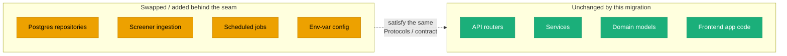

---

## 2. Target deployment topology

The production system is **four deployable units + two managed services**, each hosted
where it fits best:

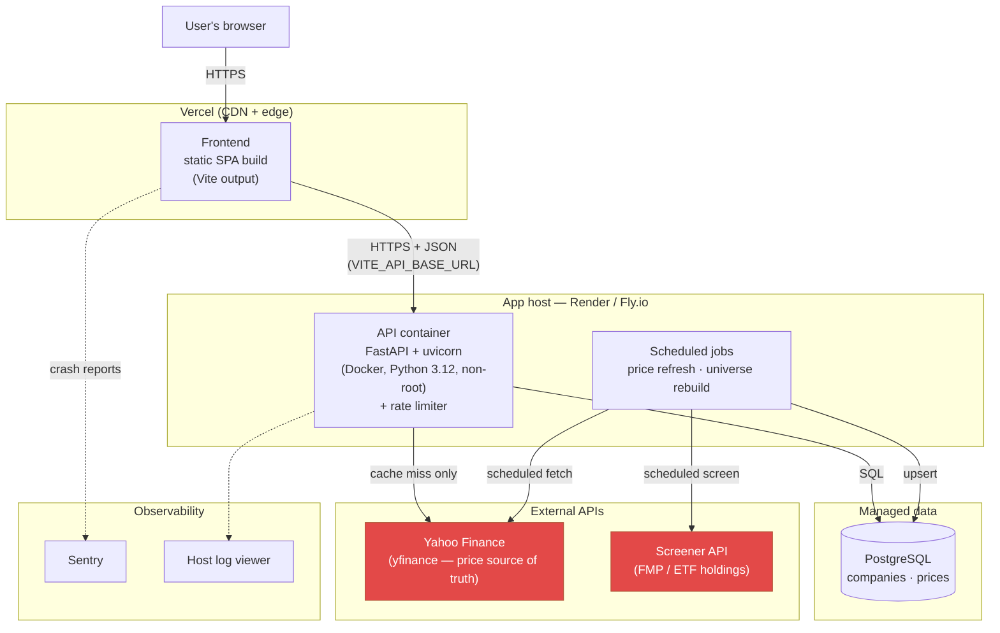

| Unit | Deployed to | Why there |
|---|---|---|
| **Frontend** (static SPA) | **Vercel** | Best-in-class React/Vite DX; automatic per-PR preview deploys; global CDN; free tier. |
| **API** (Docker) | **Render** (or Fly.io) | Auto-deploy from GitHub; managed Postgres alongside; `GET /api/health` as the healthcheck. Fly.io if we want the `ghcr.io` image to be the deploy artifact. |
| **Scheduled jobs** | Same host (cron/worker) | Reuse the API image + code; price refresh and universe rebuild run on different cadences. |
| **Postgres** | Host's managed Postgres (or Neon) | Durable, queryable store; Neon's branch-per-PR DBs are attractive once preview environments matter. |
| **External APIs** | — | Yahoo Finance stays the **price source of truth**; a screener API supplies the dynamic universe. |

---

## 3. What changes from today

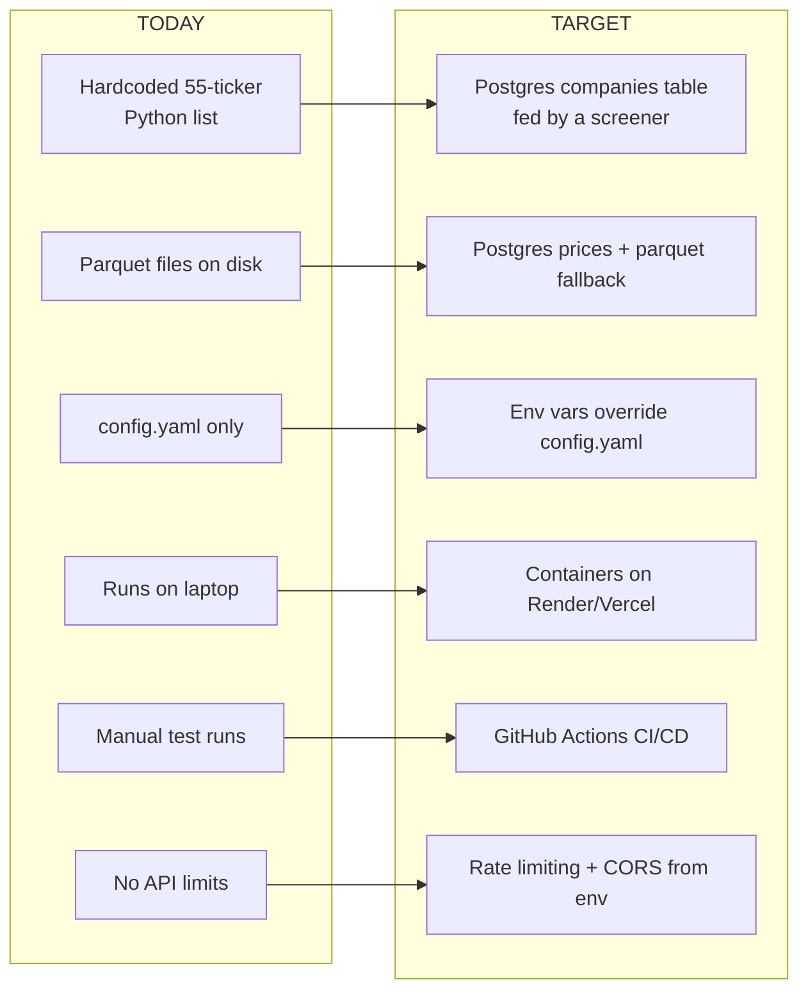

Notably, **the analysis engine, graph construction, service layer, API routes, and the
entire frontend are essentially unchanged.** The target is reached by adding storage,
ingestion, config, and delivery infrastructure *around* the stable core.

---

## 4. De-hardcoding: every value gets a real source

This table is the direct answer to the "nothing hardcoded" requirement. Each row maps a
hardcoded item from [current-architecture.md §7](current-architecture.md#7-what-is-hardcoded)
to its production replacement.

| # | Hardcoded today | Production source | Mechanism |
|---|---|---|---|
| 1 | 55-ticker universe (tickers/names/sectors) | **Postgres `companies` table**, `is_satellite_universe=true` | Populated by the screener job (§8); `list_universe()` becomes a `SELECT`. |
| 2 | Anchor list | Config, **env-overridable**; later a DB/user setting | `pydantic-settings`: env var wins, `config.yaml` fallback. |
| 3 | Analysis params (lookback, top_n, threshold, windows) | Config, env-overridable | Same as above; per-request query params already override at the edge. |
| 4 | `market_proxy_ticker` | Config, env-overridable | Same. |
| 5 | `SECTOR_ETF_MAP` | Config or a small **DB mapping table** | Re-derived against the new `industry` vocabulary (§8.3). |
| 6 | Sector→color map + palette (Python **and** TS) | **Single generated source** (e.g. a JSON emitted at build, consumed by both) | Removes the two-place duplication; graph encoding rules become data. |
| 7 | Chrome theme palette (CSS **and** JS) | Generated token file (CSS vars + JS export from one source) | Same single-source treatment. |
| 8 | `MIN_TRADING_DAYS` / `MIN_OVERLAP_DAYS` | Config (data-quality settings) | Move to `Config`; they become tunable quality gates at scale. |
| 9 | Result-cache TTL (3600s) | Config / env | Explicit setting; relevant once multi-replica (§7). |
| 10 | yfinance field mapping (only cap+volume) | Screener + enrichment pull **name/sector/industry/exchange** | Screener supplies richer metadata; enrichment fills gaps. |
| 11 | Config path, **no secrets** | **Secret manager** (host env) for `DATABASE_URL`, API keys | `.env` gitignored, `.env.example` committed. |
| 12 | CORS origins = localhost | `CORS_ALLOWED_ORIGINS` env var (real Vercel origin in prod) | Config shape already correct; prod value via env. |
| 13 | `VITE_API_BASE_URL` prod placeholder | Injected at build/deploy by Vercel | Real deployed API origin. |
| 14 | Query client defaults | Fine as code, or a small runtime config | Low priority; documented constants. |

The theme of the table: **config-with-env-override** for parameters, **Postgres** for
data, **a secret manager** for secrets, and **a single generated source** for the two
duplicated constant sets.

---

## 5. Target backend architecture

The layer diagram is the same as today with two additions (Postgres repositories, an
ingestion/screener module) and one change (env-aware config). Nothing above the
repository seam changes.

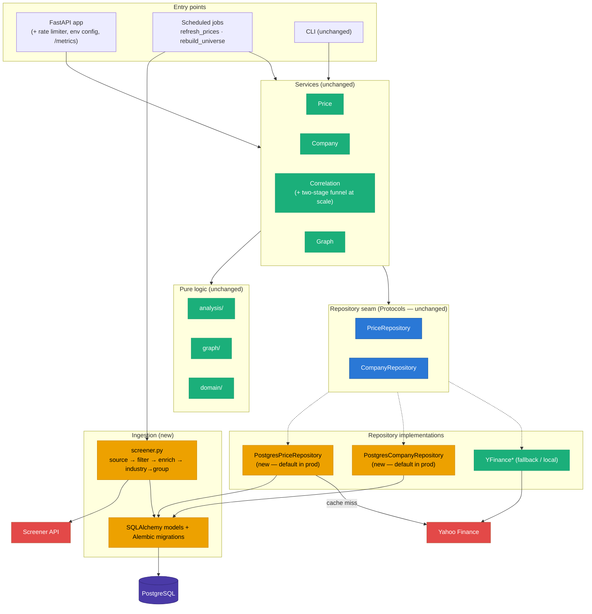

### 5.1 Postgres repositories

New `PostgresPriceRepository` / `PostgresCompanyRepository` implement the existing two
Protocols **exactly** — `get_price_history`, `list_universe`, `get_market_data`,
`get_company_facts`. No service, router, or schema changes are required, by construction.

- **Stack:** SQLAlchemy 2.0 + Alembic + `psycopg` v3, **synchronous**. Async buys
  nothing while routes are plain `def` (FastAPI already threadpools them) and would force
  touching every Protocol signature, service, and route.
- **DB models are separate from domain models** — kept in `src/repositories/postgres/models.py`
  and translated at the repository boundary, preserving the project's deliberate
  framework-agnostic `domain/` layer (no `SQLModel` fusing the two).
- **Cutover by `DATABASE_URL` presence**, not a hard swap: if set, `deps.py` builds the
  Postgres repos; otherwise it falls back to the yfinance-backed ones. Local hacking stays
  frictionless; only the two factory functions change.

### 5.2 Data model

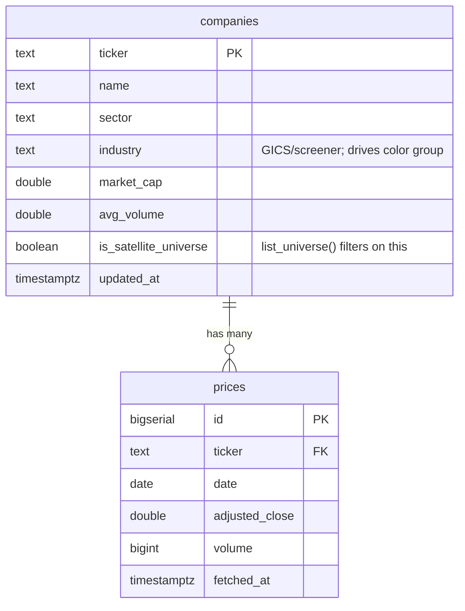

- `is_satellite_universe` is a **boolean flag, not table membership**, because
  `get_company_profile()` must resolve *any* ticker (anchors like NVDA are never in the
  universe). `list_universe()` is the one query that filters on the flag.
- `prices` is uniquely keyed on `(ticker, date)` with `ON CONFLICT DO UPDATE` — refetch is
  expected, not exceptional. Indexed on `(ticker, date)`.
- **Not stored:** computed correlation results. The in-memory result cache serves those
  cheaply; persisting recomputable analytics adds staleness/migration cost with no win
  until multi-replica inconsistency becomes real.
- A **`watchlists` / `watchlist_items`** pair is sketched for a post-v1 feature but needs
  light auth first; designed now so it isn't a rework later.

### 5.3 yfinance stays the price source of truth

Postgres is a **durable, queryable cache**, not a new data vendor. A refresh path (the
existing `POST /anchors/{ticker}/refresh` on a schedule, or the price-refresh job) keeps
rows fresh, applying the same TTL logic against each row's `fetched_at` instead of a file
mtime. The parquet cache is kept as an offline/test fallback, not deleted.

---

## 6. Configuration & secrets

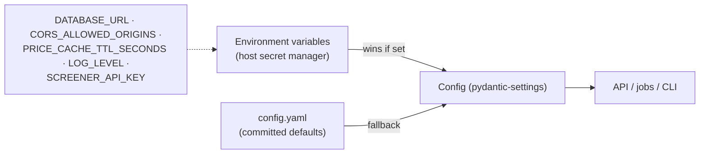

- `Config` gains **env-var overrides** via `pydantic-settings`: an env var wins, else the
  `config.yaml` default applies. Local dev needs nothing; production overrides only what
  it must.
- **Secrets never touch git.** `DATABASE_URL`, `SCREENER_API_KEY`, and deploy tokens live
  in the host's secret manager. `.env` is gitignored, `.env.example` is committed.
- Production env vars: `DATABASE_URL`, `CORS_ALLOWED_ORIGINS` (real Vercel origin),
  `PRICE_CACHE_TTL_SECONDS`, `LOG_LEVEL`, `SCREENER_API_KEY`.

---

## 7. Caching & performance

The two-level cache from today is kept and extended:

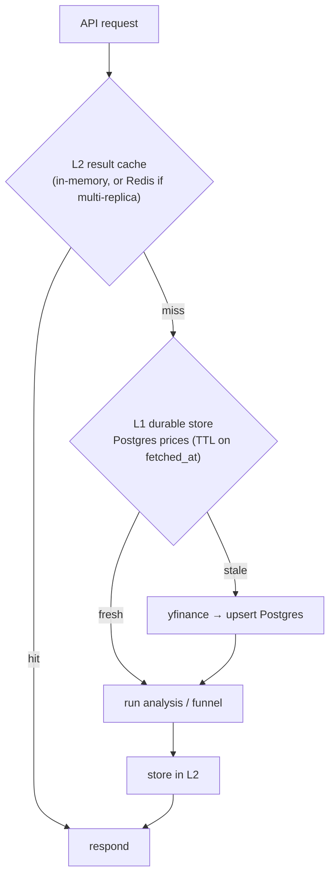

- **L1 becomes Postgres** (durable, survives restart, shared across replicas) with the
  parquet cache demoted to a fallback. A cold API instance no longer re-downloads
  everything from Yahoo — it reads warm rows from the DB.
- **L2 stays the in-memory result cache** for a single replica. If we scale to multiple
  API replicas, promote L2 to **Redis** so the cache is consistent across them (a real
  trigger, not a day-one need).
- **Two-stage correlation funnel** (needed once the universe is large, §8.4): a cheap
  raw-Pearson pre-filter to a shortlist, then the full Phase-4 diagnostic stack only on the
  shortlist — the difference between tractable and not at N in the thousands.

### Performance budget (frontend, already targeted)

LCP < 3.1s · INP < 250ms · CLS < 0.12 · initial JS bundle < 310 KB gz. The graph library
is already code-split (`lazy()`), and a CDN (Vercel) serves the static build.

---

## 8. Dynamic universe (the biggest de-hardcoding)

Replacing the 55-ticker list is the deepest change and has its own full design in
[universe-roadmap.md](../backend_docs/universe-roadmap.md). Architecturally it plugs into
the **same `CompanyRepository.list_universe()` seam** — everything above it is untouched.

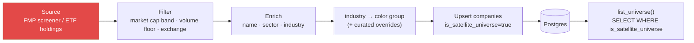

The central tension is **curation quality vs. scale**: the hand-list gives clean names,
fine-grained sectors, and thematic relevance *for free*; a dynamic universe must re-earn
all three. Key decisions (detailed in the roadmap):

1. **Breadth** — start *curated-but-dynamic* (a screened tech/semiconductor pool in the
   low hundreds), not the full Russell 2000, to preserve relevance and graph coherence.
2. **Sector taxonomy** — use the `industry` field (closer to the hand labels than coarse
   GICS `sector`) + a small curated override table; re-derive the color-group mapping
   against the new vocabulary.
3. **Statistical safeguards at scale** — a higher practical threshold, **stability gating
   as a hard filter**, and a multiple-comparisons correction (Benjamini-Hochberg FDR)
   become mandatory once N grows, or spurious r≥0.6 hits appear by pure chance.
4. **Refresh cadence** — a *separate, slower* universe-rebuild job (weekly/monthly),
   distinct from the daily price refresh.

**Its real prerequisite is Postgres (§5), not the frontend** — a drifting universe of
hundreds of screened tickers belongs in the `companies` table, not a Python list or parquet.

---

## 9. Scheduled jobs & data flow

Two independent scheduled jobs, on different cadences, both reusing the API's code/image:

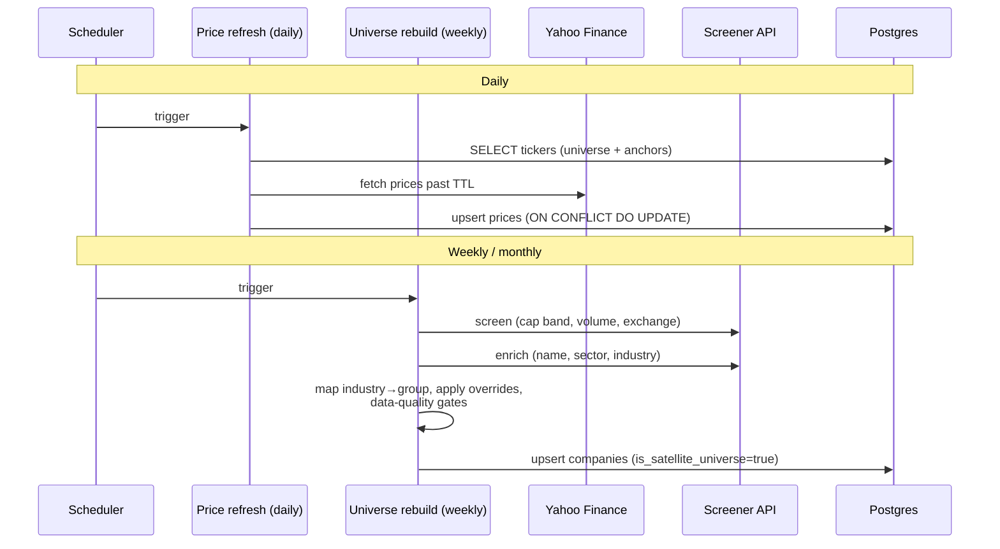

Separating the cadences is a cost/correctness decision: prices drift daily, the universe
drifts on index rebalances (quarterly) and cap changes — rebuilding the whole screened
universe every day would waste API budget and risk rate-limiting.

---

## 10. Frontend in production

The frontend needs **no architectural change** — it is already a static SPA built against
a fixed, typed API contract. Production is about *delivery*:

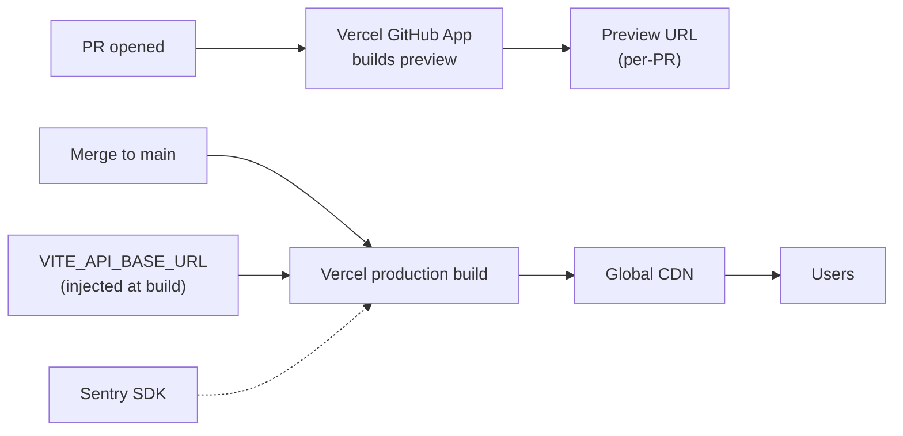

- **Vercel** builds a preview per PR (a live URL for reviewing UI changes) and production
  on merge. The API base URL is injected at build time.
- **Sentry** is wired in early — cheap, high-value for a public UI where crashes otherwise
  go unheard.
- **Frontend tests** (currently zero): add Vitest + React Testing Library for components
  and 1–2 Playwright smoke tests — matching the backend's "focused, not exhaustive"
  philosophy.
- The dynamic universe (§8) unlocks new UI that is near-useless at N=55: a **sector/
  industry filter**, a **candidate-pool-size indicator** ("top 15 of 340 candidates"), and
  candidate-pool transparency — all forward-compatible because the frontend already avoids
  hardcoding anchor/satellite counts.

---

## 11. CI/CD pipeline

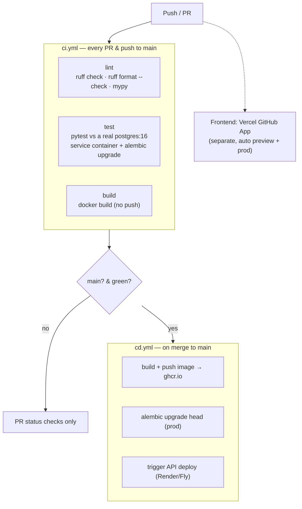

- **GitHub Actions** (origin is already a GitHub remote). Two workflows keep status checks
  legible: `ci.yml` (lint/test/build) and `cd.yml` (image push + migrate + deploy).
- **Tests run against a real Postgres** service container in CI — catches migration/
  constraint bugs a mock can't.
- **Images go to `ghcr.io`** (free, `GITHUB_TOKEN` auth, no extra secret).
- **The frontend deploy is not a GitHub Actions step** — Vercel's GitHub App owns it.
- **Branch protection** requires `lint` + `test` green before merge.

### Engineering hygiene (the CI gate has teeth only if these exist)

Add **Ruff** (lint+format, replaces flake8/isort/black) and **mypy** (gradual, not
`--strict` on day one), wired into `pre-commit` and the same `make`/`just` targets CI
calls. The first `ruff format` run touches every file — land it as its own commit.

---

## 12. Security, observability & operations

| Concern | Approach |
|---|---|
| **Rate limiting** | `slowapi` on the API (independent of yfinance's own throttling) so one heavy user can't hammer the server. Give `POST /refresh` its own stricter limit — it's a direct yfinance-round-trip trigger and an easy abuse vector. |
| **CORS** | From `CORS_ALLOWED_ORIGINS` env var; the real Vercel origin in prod, not localhost. |
| **Secrets** | Host secret manager; `.env` gitignored; `.env.example` committed. |
| **Container hardening** | Non-root user, slim base image, `.dockerignore` trimming build context. |
| **Auth** | Not in v1 (read-only public dashboard). Required before watchlists / multi-user state. |
| **Logging** | Already uses `logging`, not `print()`. Start with the host's built-in log viewer; `LOG_LEVEL` from env. |
| **Error tracking** | Sentry on the frontend early; defer a dedicated backend APM until real traffic justifies it. |
| **Rough cost** | Hobby-scale ~$0–25/mo: Render web+Postgres, Vercel free tier, `ghcr.io` free. |

---

## 13. Migration path (summary)

The full sequencing lives in the roadmaps; the shape is:

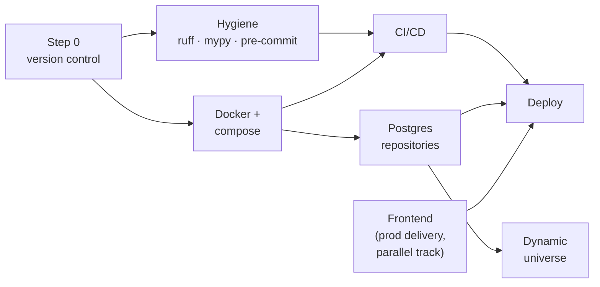

- **Frontend delivery has no hard dependency on the infra track** — it only needs the API,
  which is already stable. Run them in parallel if bandwidth allows.
- **The dynamic universe's true gate is Postgres**, not the frontend (a common
  misconception — it is *sequenced* after the frontend by preference, but *depends* on the DB).
- Detailed steps, illustrative Dockerfiles/compose/SQL, and every open decision:
  [production-roadmap.md](../backend_docs/production-roadmap.md) and
  [universe-roadmap.md](../backend_docs/universe-roadmap.md).

---

## 14. Open architectural decisions

Judgment calls baked into this target, surfaced so they can be redirected:

- **Render** for API + Postgres hosting (vs. Fly.io, Railway, raw cloud).
- **SQLAlchemy 2.0 + Alembic + psycopg3, synchronous** (vs. SQLModel, vs. async).
- **Postgres as the durable price cache** with parquet as fallback (vs. keeping parquet,
  vs. a dedicated time-series DB).
- **Not persisting correlation results** in Postgres yet (vs. a `correlations` table now).
- **In-memory L2 cache**, promoting to Redis only when multi-replica (vs. Redis from day one).
- **Curated-but-dynamic universe** to start (vs. broad Russell-2000-scale immediately).
- **`industry`-based sector taxonomy + overrides** (vs. accepting coarse GICS).
- **FMP screener** as the universe source (vs. ETF-holdings CSVs, vs. Polygon/Tiingo/Finnhub).
- **Vercel** for the frontend (vs. Netlify, Cloudflare Pages).
- **Trunk-based deploy** on every merge to `main` (vs. tag-based releases).

---

## 15. The end state, in one paragraph

A user hits a **CDN-served React SPA** on Vercel. It calls a **containerized FastAPI**
service on Render, rate-limited and configured entirely by environment variables. The API
reads its satellite universe and warm price history from **Postgres** — the universe kept
current by a **weekly screener job**, prices by a **daily refresh job**, both upserting
into the same tables and both falling back to **Yahoo Finance** only on a cache miss. The
correlation engine, graph builder, and every service are **the exact code that runs
today**, unchanged, because the storage swap happens entirely behind the repository
Protocols. Every push runs **lint, type-check, and tests against a real Postgres** in
GitHub Actions before building an image and deploying. Nothing is hardcoded: not the
universe, not the parameters, not the secrets, not the API origin. Adding a stock is a row
in a table a job wrote — never an edit to a Python file.
