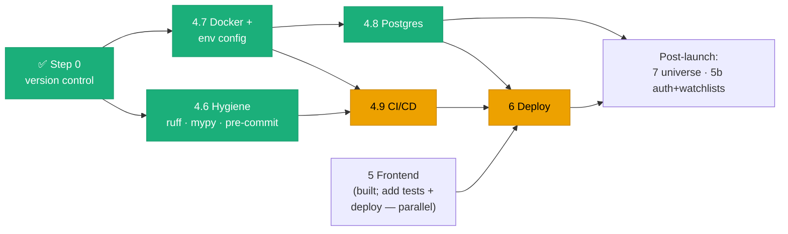

# Production Roadmap: From Committed Codebase to Deployed Product

**Scope:** the route from *"code is written, committed, and pushed; runs locally"* to
*"a clean, production-grade codebase deployed and publicly usable."* Covers engineering
hygiene, containerization, Postgres, CI/CD, frontend hardening, deployment, and what
comes after launch.

This is the **route**; the **destination** is [target-architecture.md](target-architecture.md)
(the end-state component topology, data model, and every design decision). Read that for
*what* we're building toward; read this for *what to do, in what order, starting now.*

> **Last reconciled against the repo:** August 2026 — verified directly (`git log`,
> filesystem), not assumed. Where earlier drafts of this doc described gaps that are now
> closed, they're marked ✅ below rather than silently deleted, so the progress is legible.

---

## 1. Current status — what's done, what's left

Legend: ✅ done · 🟡 partially done · ⬜ not started.

| Area | Status | Evidence / notes |
|---|---|---|
| **Version control** | ✅ | 2 commits on `main`, pushed to `origin/main` (`github.com/ankitsree/stock_dependency_tracker`), working tree clean. *(This was "Step 0" — now complete.)* |
| **Backend (Phases 1–4.5)** | ✅ | Layered API + services + repositories + CLI; 142 tests pass. See [phase4-5.md](../phase4-5.md). |
| **Frontend (Phase 5)** | 🟡 | **Built and committed** — all four views (graph, satellite table, ticker detail + sparkline, relatedness heatmap), free-text search, light/dark theme, responsive, accessible table. **Missing:** any frontend tests, a real production API URL, and deployment. See §8. |
| **Engineering hygiene (4.6)** | ✅ | `ruff` + `mypy` configured in [pyproject.toml](../../pyproject.toml), [.pre-commit-config.yaml](../../.pre-commit-config.yaml), and a [Makefile](../../Makefile) whose targets CI will call verbatim. `make check` is green: lint, format, 46 files type-clean, 142 tests pass. |
| **Containerization (4.7)** | ✅ | [Dockerfile](../../Dockerfile) (multi-stage, Python 3.12, non-root `appuser`), [.dockerignore](../../.dockerignore), [docker-compose.yml](../../docker-compose.yml) (API + Postgres 16, healthchecked). `Config` is now `pydantic-settings`-backed: **env wins, `config.yaml` falls back** ([src/config.py](../../src/config.py)). Verified end-to-end — see §5. |
| **Postgres (4.8)** | ✅ | [src/repositories/postgres/](../../src/repositories/postgres/) — `PostgresPriceRepository`/`PostgresCompanyRepository` satisfy the existing Protocols exactly; [deps.py](../../src/api/deps.py) cuts over on `DATABASE_URL` presence. Alembic migration applied and verified against real Postgres (17 repository tests + full backfill). **Live on Render** — `stockdep-db` provisioned, migrated, and backfilled against real Yahoo data; the deployed API serves from it (`database_url_configured=True`). |
| **CI/CD (4.9)** | ✅ | [.github/workflows/ci.yml](../../.github/workflows/ci.yml) (lint + type-check + test-against-real-Postgres + build, on every PR/push) and [cd.yml](../../.github/workflows/cd.yml) (build, push to `ghcr.io`, migrate prod, then trigger the Render deploy hook, on merge to `main`). `render.yaml`'s `autoDeploy` is now `false` on purpose — `cd.yml` owns deploy ordering so migrations always run before the new code goes live. **Needs repo setup to go green** — see §7. |
| **Deployment (6)** | 🟡 | API live on Render, frontend live on Vercel, Postgres live and backfilled. Still open: rate limiting, Sentry, the go-live checklist in §9.5. |
| **Secrets hygiene** | ✅ | `.env` (and `*.local`) gitignored; [.env.example](../../.env.example) committed as the documented template. |
| **Dynamic universe (7)** | ⬜ | Post-launch; gated on Postgres. See [universe-roadmap.md](../backend_docs/universe-roadmap.md). |
| **Auth + watchlists (5b)** | ⬜ | Post-launch; gated on Postgres. See §8.5. |

**Two doc-hygiene items** surfaced during this reconcile (cheap to fix, and they matter
for a "clean" repo):

- ~~**Duplicate file:** `target-architecture.md` in both `docs/architecture/` and
  `docs/prod_roadmap/`.~~ ✅ resolved — `docs/prod_roadmap/` is the single home, and
  `current-architecture.md` moved there alongside it.
- **Stale index:** the root [README.md](../../README.md) doc-index and some links inside
  [phase4-5.md](../phase4-5.md) still point at the old flat `docs/*.md` paths from before
  docs were reorganized into `backend_docs/` / `frontend_docs/` / `architecture/` /
  `prod_roadmap/`.

Nothing here blocks what's built — 142 backend tests pass and the app runs end-to-end
locally. This is a punch list to production, not a rescue.

---

## 2. The path at a glance

Phase numbering is kept from earlier drafts (and referenced by
[target-architecture.md](target-architecture.md) and
[universe-roadmap.md](../backend_docs/universe-roadmap.md)) so the docs stay consistent.

| Phase | Goal | Status | Depends on | Rough effort |
|---|---|---|---|---|
| ~~Step 0~~ | Version control | ✅ done | — | — |
| **4.6** | Lint, format, type-check, pre-commit | ✅ done | Step 0 | — |
| **4.7** | Docker + compose + env-var config | ✅ done | Step 0 | — |
| **4.8** | Postgres-backed repositories + migrations | ✅ done, live on Render | 4.7 (local DB via compose) | — |
| **4.9** | CI/CD (GitHub Actions) | ✅ workflows written; **repo secrets setup next** | 4.6, 4.7 | — |
| **5** | Frontend | 🟡 built; needs tests + prod wiring | REST API (done) | ~2–3 days remaining |
| **6** | Deployment & operations | 🟡 API + Postgres + frontend live; rate limiting/Sentry/checklist remain | 4.7, (4.8), 4.9, 5 | 1–2 days |
| **7** | Dynamic universe | ⬜ post-launch | 4.8 | see universe-roadmap |
| **5b** | Watchlists + auth | ⬜ post-launch | 4.8 | — |



`CI` and `DEP` are amber: the workflows and hosting are all in place, but `CI` still needs
repo secrets before it goes green (§7) and `DEP` still needs rate limiting/Sentry/the go-live
checklist (§9.5) before it's genuinely production-hardened.

**Frontend has no hard dependency on the infra track** — it only needs the (stable) API.
Its remaining work (tests, prod env, Vercel deploy) can run in parallel with 4.6–4.9.

---

## 3. Start here — the immediate next steps

~~Step 1 — Engineering hygiene (4.6)~~ and ~~Step 2 — Containerize + externalize config
(4.7)~~ are **done** (§4, §5). The codebase is clean, containerized, and configured from
the environment. What follows is the remaining sequence.

### Step 1 — Postgres (Phase 4.8) ✅ done, live on Render
SQLAlchemy models, an Alembic migration, `PostgresPriceRepository`/`PostgresCompanyRepository`,
and the `deps.py` cutover all exist and are verified against a real Postgres — 17 repository
tests plus a full backfill against live Yahoo data, both locally (`make up`) and against the
live `stockdep-db` on Render. The deployed API serves from it.

### Step 2 — CI/CD (Phase 4.9) ✅ workflows written
[.github/workflows/ci.yml](../../.github/workflows/ci.yml) and
[cd.yml](../../.github/workflows/cd.yml) exist and call the same `Makefile`/`Dockerfile`
targets a human would run locally. **What's left is repo setup, not code** — adding the
`DATABASE_URL` and `RENDER_DEPLOY_HOOK_URL` secrets and enabling branch protection. Detail
in §7.

### Step 3 — Choose your progression
Two honest paths to *live*:

| Path | Sequence | Trade-off |
|---|---|---|
| **Solid (recommended)** | 4.8 Postgres → 4.9 CI/CD → 6 Deploy | Durable from day one; cold starts read warm rows from the DB, not Yahoo. ~1 week more before live. |
| **Fast demo** | 6 Deploy now (yfinance + parquet, no DB) → then 4.8 → 4.9 | A live URL in a day, but fragile: Render's ephemeral disk loses the parquet cache on every restart, so cold starts re-hit Yahoo and risk rate-limiting. Fine for a demo, not for real use. |

**Recommendation:** the solid path. The one exception — deploy the **frontend** to Vercel
early regardless (Step in §8), since it only needs an API URL and gives you a live preview
to iterate against.

The rest of this document is the reference detail for each phase.

---

## 4. Phase 4.6 — Engineering hygiene ✅

**Goal:** one command lints, one formats, one type-checks — the same commands locally and
in CI. This is the backbone of "clean codebase."

| Concern | Tool | Why |
|---|---|---|
| Lint + format | **Ruff** | Replaces flake8 + isort + black with one Rust-fast tool; single config block in `pyproject.toml`. |
| Type-check | **mypy** | The code already leans on modern hints (`from __future__ import annotations`, `X \| None`, pydantic v2) — a good mypy fit, just unenforced. |
| Pre-commit hooks | **pre-commit** | Runs Ruff (+ optionally mypy) before a commit lands, not just in CI. |

`pyproject.toml` additions (illustrative):

```toml
[tool.ruff]
line-length = 120
target-version = "py39"

[tool.ruff.lint]
select = ["E", "F", "I", "UP", "B"]

[tool.mypy]
python_version = "3.9"
plugins = ["pydantic.mypy"]
check_untyped_defs = true
# yfinance / networkx / pyvis ship no type stubs
[[tool.mypy.overrides]]
module = ["yfinance.*", "networkx.*", "pyvis.*"]
ignore_missing_imports = true
```

**Key decisions:**
- **Gradual mypy, not `--strict` on day one.** Strict across ~50 existing files is a wall
  of errors with no proportional payoff. Start with `check_untyped_defs`, ratchet up
  (`disallow_untyped_defs`, then `disallow_any_generics`) module by module.
- **No docstring-coverage linter.** [CLAUDE.md](../../CLAUDE.md)'s convention is
  deliberately comment-light; a docstring linter would fight house style.
- **The first `ruff format` run touches every file.** Land it as its own commit, separate
  from any logic change, so it's trivially reviewable/revertable.

**Deliverable:** `.pre-commit-config.yaml` wired to Ruff (+ mypy if you want it
pre-commit; it's slower, so CI-only is also reasonable), plus `make lint` / `make format`
/ `make typecheck` targets (or a `justfile`) so Phase 4.9's CI calls the *exact* commands
a human runs locally.

---

## 5. Phase 4.7 — Containerization + env config ✅

**Goal (met):** `docker compose up` brings up API + Postgres locally with zero manual
setup; a production `Dockerfile` builds a deployable image; and config comes from the
environment, not just a committed YAML file.

**What was built:** [Dockerfile](../../Dockerfile), [.dockerignore](../../.dockerignore),
[docker-compose.yml](../../docker-compose.yml), [.env.example](../../.env.example), an
env-aware [src/config.py](../../src/config.py), and `make docker-build` / `up` / `down` /
`logs` targets.

**Verified, not assumed:**

| Check | Result |
|---|---|
| `docker build` | ~70s, image 820 MB (pandas/scipy/pyarrow/matplotlib dominate) |
| `GET /api/health` in-container | `{"status":"ok"}`; Docker `HEALTHCHECK` reaches `healthy` |
| `docker compose up` | API waits on `pg_isready`; both services healthy; Postgres 16.14 |
| Env override | `ANCHORS=NVDA,AMD` visibly changes the startup log |
| CORS | allowed origin echoed back; disallowed origin gets no `access-control-allow-origin` |
| Non-root | `uid=10001(appuser)` |
| Live API call | `GET /api/companies/NVDA` returns real data through the container |

**Config precedence.** `Config` is a `pydantic-settings` `BaseSettings`, but note that
pydantic-settings ranks *init kwargs above env vars* — so loading YAML straight into
`Config(**raw)` would invert the precedence we want. `load_config()` therefore drops any
YAML key already supplied by the environment (or `.env`) and lets the settings sources
fill it in, which also gets env values pydantic's parsing and validation for free. Env var
names are field names upper-cased, no prefix. List-valued vars (`ANCHORS`,
`CORS_ALLOWED_ORIGINS`) accept comma-separated *or* JSON form.

**`eval_type_backport` is now conditional** — `; python_version < '3.10'`. The 3.12
container skips it entirely (verified: the app imports fine without it there) while the
local 3.9 venv still gets it. This closes the open question flagged below.

**Deliberately deferred:** moving `MIN_OVERLAP_DAYS` / `MIN_TRADING_DAYS`
([src/analysis/correlation.py](../../src/analysis/correlation.py)) into `Config`
(target-architecture §4 #8). It would thread config through every pure analysis function
and its tests for no deployment benefit; it belongs with Phase 7, when universe scale
makes them genuinely tunable.

**Key decisions:**
- **Container on Python 3.12**, even though the local `venv` floors at 3.9. Nothing in the
  deps needs <3.11. `eval_type_backport` (added only to work around a 3.9-specific
  pydantic/FastAPI annotation issue — see [phase4-5.md](../phase4-5.md)) is now carried
  behind an environment marker rather than dropped outright, so both interpreters work.
  `pyproject.toml`'s floor stays at 3.9.
- **Non-root user** (`appuser`) — cheap hardening for an internet-facing container.
- **`.dockerignore`** excluding `venv/`, `data/cache/*`, `__pycache__/`, `tests/`,
  `docs/`, `.git/`, `frontend/` — keeps the build context and image small.
- **Env-var config (a real code change, not just infra).** `Config`
  ([src/config.py](../../src/config.py)) reads only YAML today — wrong for a container
  where `DATABASE_URL` and API keys must not be baked into the image. Add
  `pydantic-settings`-style overrides: **env var wins if set, else `config.yaml`.** This
  single change unblocks secrets, the Postgres cutover (§6), and the CORS/TTL overrides
  deployment needs (§9). It maps directly to the "nothing hardcoded" goal in
  [target-architecture.md §6](target-architecture.md).

**The compose stack** is [docker-compose.yml](../../docker-compose.yml) — read the file
rather than a sketch of it. Two things worth knowing without opening it:

- The API reaches Postgres at hostname `db`, not `localhost`: compose puts both services
  on one network with DNS between them.
- `depends_on: condition: service_healthy` gates API startup on `pg_isready`, so the API
  never boots against a database still initialising.

`GET /api/health` is both the container `HEALTHCHECK` target and the natural probe for any
orchestrator later. No frontend service is defined — the frontend runs via `npm run dev`
locally and deploys to Vercel, not into compose.

**The container is the API only.** The frontend is a separate deployable (§8, §9): Vercel
builds the Vite output to a CDN. Vercel cannot host this image — it has no facility for a
long-lived Python process. The two halves are joined by exactly two settings:
`VITE_API_BASE_URL` (frontend → API) and `CORS_ALLOWED_ORIGINS` (API → allows frontend).

---

## 6. Phase 4.8 — Postgres migration ✅ (locally) / next: Render

The phase [src/repositories/base.py](../../src/repositories/base.py) was explicitly built
for:

> a future Postgres-backed repository satisfies the same contract with zero changes to
> services/routes/schemas — only `src/api/deps.py`'s factory functions change.

**What goes in Postgres, and what doesn't:**
- `prices` and `companies` tables — replace the parquet cache and the hardcoded
  `SATELLITE_UNIVERSE` list ([src/data/universe.py](../../src/data/universe.py)) with
  real, queryable, updatable-without-a-deploy storage. This `companies` table is also the
  substrate for **Phase 7** ([universe-roadmap.md](../backend_docs/universe-roadmap.md)),
  which populates it from a screener — that phase's true prerequisite is this one.
- **Not** computed correlation results. The in-memory TTL cache serves those cheaply;
  persisting recomputable analytics adds staleness/migration cost with no win until
  multi-replica inconsistency is real.
- **Not** valuation ratios either (P/E, PEG, beta, business summary, ...) — never in this
  schema, so `PostgresCompanyRepository.get_company_facts()` goes straight to yfinance,
  same as the yfinance-backed repository. A single-ticker detail-view fact, not
  universe/graph data; adding a wide, rarely-queried column set to `companies` for one
  slow per-ticker endpoint wasn't worth it.
- **`watchlists` sketch only** (Phase 5b, §8.5) — designed now so it isn't a rework later,
  but not built here; it needs light auth first.

**Schema** — as built, in [migrations/versions/](../../migrations/versions/) (autogenerated
from [src/repositories/postgres/models.py](../../src/repositories/postgres/models.py) and
diffed by eye against the sketch below before applying):

```sql
CREATE TABLE companies (
    ticker TEXT PRIMARY KEY,
    name TEXT NOT NULL,
    sector TEXT NOT NULL,
    industry TEXT,                          -- unused until Phase 7's screener job
    market_cap DOUBLE PRECISION,
    avg_volume DOUBLE PRECISION,
    is_satellite_universe BOOLEAN NOT NULL DEFAULT false,
    updated_at TIMESTAMPTZ NOT NULL DEFAULT now()
);

CREATE TABLE prices (
    id BIGSERIAL PRIMARY KEY,
    ticker TEXT NOT NULL REFERENCES companies(ticker),
    date DATE NOT NULL,
    adjusted_close DOUBLE PRECISION NOT NULL,
    volume BIGINT,
    fetched_at TIMESTAMPTZ NOT NULL DEFAULT now(),
    UNIQUE (ticker, date)
);
CREATE INDEX idx_prices_ticker ON prices (ticker);

-- Phase 5b sketch only — not built in 4.8
-- CREATE TABLE watchlists (id, user_id, name, created_at);
-- CREATE TABLE watchlist_items (watchlist_id, ticker);
```

`is_satellite_universe` is a **flag, not table membership**, because
`CompanyService.get_company_profile()` must resolve *any* ticker (anchors like NVDA are
never in the universe). `list_universe()` is the one query that filters on the flag.

**Key decisions:**
- **SQLAlchemy 2.0 + Alembic + `psycopg` v3, synchronous.** Boring and well-supported.
  Not `SQLModel` — it would blur the deliberate separation between the framework-agnostic
  `src/domain/models.py` and storage. Keep DB models in a new
  `src/repositories/postgres/models.py` and translate at the repository boundary.
- **Stay synchronous.** Routes are plain `def` (FastAPI threadpools them), so an async
  driver buys nothing yet and would mean touching every `Protocol` signature, service, and
  route. Revisit only if profiling shows the threadpool is the bottleneck.
- **Cutover via `DATABASE_URL` presence, not a hard swap.** In
  [src/api/deps.py](../../src/api/deps.py): if `DATABASE_URL` is set, build the Postgres
  repos; else fall back to the yfinance-backed ones. Local hacking stays frictionless.
- **yfinance stays the upstream source of truth.** Postgres is a durable cache, not a new
  vendor. A refresh path (the existing `POST /anchors/{ticker}/refresh` on a schedule, or
  the price-refresh job in §9-of-target) keeps rows fresh using `price_cache_ttl_seconds`
  against each row's `fetched_at`.
- **Upsert, don't insert-and-fail** — `ON CONFLICT DO UPDATE` on both tables.
- **Batch upserts at 2000 rows** ([price_repository.py](../../src/repositories/postgres/price_repository.py)
  `_UPSERT_BATCH_SIZE`) — Postgres caps bound parameters at 65535/query, and a full
  backfill (tens of tickers x a year of trading days) blows past that in one INSERT.
  Found by actually running the backfill against live data, not anticipated up front —
  covered by a regression test (`test_upsert_spanning_multiple_batches_writes_every_row`).
- **A ticker with no `companies` row yet gets a placeholder** (`name=ticker,
  sector="Unknown"`) before its price rows can satisfy the FK — e.g. an anchor never in
  the curated universe. `ON CONFLICT DO NOTHING` on that placeholder insert, so it never
  clobbers a real name/sector already seeded by the universe backfill. This matches
  behavior the yfinance-backed system already had (`CompanyService.get_company_profile()`
  already fell back to `name=ticker, sector="Unknown"` for any non-universe ticker) —
  not a new behavior, just a new place it has to be written down.
- **Keep `data/cache/*.parquet`** as an offline/test fallback; just stop it being the only
  store.

**What was built** (mirrors the plan above, one addition it surfaced):
1. `PostgresPriceRepository`/`PostgresCompanyRepository`
   ([src/repositories/postgres/](../../src/repositories/postgres/)) implement the two
   `Protocol`s exactly — no service/router changes.
2. Alembic ([alembic.ini](../../alembic.ini), [migrations/](../../migrations/)); one
   migration creates `companies`/`prices` with the indexes/constraints, autogenerated
   from the SQLAlchemy models and applied against the compose `db`.
3. `python -m src.cli backfill-postgres` ([src/cli.py](../../src/cli.py)) seeds the
   universe (real name/sector, `is_satellite_universe=true`) then backfills price
   history + market data for anchors + universe, via the same
   `fetch_price_history`/`fetch_metadata` the yfinance repository uses — Postgres gets a
   durable upsert in addition, not a different fetch path.
4. `deps.py`'s two factory functions cut over on `DATABASE_URL` presence, sharing one
   engine/session factory (`get_session_factory()`) rather than one each.
5. **Verified against a real Postgres, not mocks** — 17 tests in
   [tests/repositories/postgres/](../../tests/repositories/postgres/), skipped (not
   failed) when no `DATABASE_URL` is reachable so a plain `pytest -q` still passes
   without Docker running. Plus a full manual run: `make up` → `alembic upgrade head` →
   `backfill-postgres` against live Yahoo data → `GET /api/graph` through the container,
   confirmed serving from Postgres (`database_url_configured=true` in the startup log).

### 6.1 Doing this on Render — the remaining step

Local Postgres (§5's compose `db`) has worked against this code since before it was
written; the render.yaml blueprint from Stage 1 only ever declared the API service.
Adding the database is now a blueprint change, not a new capability:

1. **Sync the updated `render.yaml`** — Render dashboard → the `stockdep-api` Blueprint →
   it detects `databases: [stockdep-db]` and the new `DATABASE_URL` env var (wired via
   `fromDatabase`, so no credential is ever typed in) → apply. Creates a managed Postgres
   16 in the same region as the API.
2. **Run the migration.** `render.yaml`'s `preDeployCommand` is present but commented —
   Pre-Deploy Commands need a paid web-service plan, and the service is still on `free`
   from Stage 1. Until upgrading, run it manually: Render dashboard → `stockdep-api` →
   **Shell** tab → `alembic upgrade head`.
3. **Backfill once:** same Shell tab → `python -m src.cli backfill-postgres`. Safe to
   re-run (everything is an upsert); only needs to happen once to seed real data.
4. **Verify:** `GET /api/companies` should return 55 companies: cutover confirmed working
   the moment that list is non-empty, since `list_universe()` has no yfinance fallback
   by design (§6, "what doesn't" go through Postgres wasn't the point here — the universe
   *only* comes from the DB now).
5. **Optional — upgrade off `free`.** Removes the ~15-minute spin-down (now much less
   costly than in Stage 1, since a cold start reads from Postgres instead of Yahoo) and
   unlocks `preDeployCommand`, automating step 2 on every future deploy. Uncomment that
   line in `render.yaml` after upgrading.

---

## 7. Phase 4.9 — CI/CD pipeline ✅ (workflows written; repo setup next)

**Goal:** every PR is auto-linted, type-checked, and tested against a real Postgres; every
merge to `main` builds, migrates, and deploys — in that order, not hoped-for order.

Two workflow files, both committed:

### [`.github/workflows/ci.yml`](../../.github/workflows/ci.yml) — every PR and push to `main`

| Job | What it does |
|---|---|
| `lint` | `make lint-check format-check typecheck` — fast, no DB. |
| `test` | Spins up a `postgres:16` **service container**, runs `alembic upgrade head`, then `make test` with `DATABASE_URL` pointed at it — exercises the real Postgres repositories (`tests/repositories/postgres/`), not just the yfinance-backed ones. |
| `build` | `docker build` only, PRs only — confirms the image builds without redoing `cd.yml`'s real build on every push to `main`. |

### [`.github/workflows/cd.yml`](../../.github/workflows/cd.yml) — on merge to `main`

1. Build the image, tag with git SHA + `latest`, push to **`ghcr.io`** (free, `GITHUB_TOKEN`
   auth, no extra secret).
2. Run `alembic upgrade head` against production, using a `DATABASE_URL` secret.
3. `curl` Render's **Deploy Hook** to trigger the API deploy.
4. **Frontend deploy is not a GitHub Actions step** — Vercel's GitHub App auto-builds PR
   previews and production on merge (less to maintain, live preview per UI PR).

Step 2 runs **before** step 3 on purpose — see the `autoDeploy: false` comment in
`render.yaml`. Render's git-push auto-deploy has no way to wait for a migration to finish,
so it's disabled; `cd.yml`'s explicit Deploy Hook call is now the only thing that puts a new
build live, and it only fires after the migration succeeds.

### Repo setup needed before this goes green

1. **GitHub Environment.** Settings → Environments → New environment → name it `production`.
   Both `cd.yml` jobs that touch secrets reference this environment, so scoping secrets to it
   (rather than plain repo secrets) means they're only ever readable by a `main`-branch run.
2. **`DATABASE_URL` secret** (in the `production` environment). Same External Database URL
   already used for the manual Render migrations — Render dashboard → `stockdep-db` →
   Connect → External Database URL.
3. **`RENDER_DEPLOY_HOOK_URL` secret** (in the `production` environment). Render dashboard →
   `stockdep-api` → Settings → Deploy Hook → copy URL. Treat it as a secret: anyone with the
   URL can trigger a deploy.
4. **Branch protection.** Settings → Branches → add a rule for `main` → require the `lint`
   and `test` status checks to pass before merging.
5. Optional: add a CI badge to the root README once the first run is green.

`ghcr.io` needs no extra secret — `GITHUB_TOKEN` is enough for `packages: write`. `.env` is
already gitignored with `.env.example` committed, so no action there.

---

## 8. Phase 5 — Frontend 🟡 (built; hardening + deploy remain)

The frontend is **built and committed** — this section is now about finishing and shipping
it, not building it. For the original build sequence and design rationale, see
[frontend-roadmap.md](../frontend_docs/frontend-roadmap.md) and
[frontend-build-plan.md](../frontend_docs/frontend-build-plan.md).

### 8.1 What's built
Vite + React 19 + TypeScript + Tailwind v4 + TanStack Query/Table + react-force-graph-2d
+ React Router + `openapi-typescript` (typed client) + Martian Mono. All four views work
against the API: force-directed graph, sortable diagnostics table, ticker detail panel
(with a hand-rolled SVG sparkline), free-text ticker search, and the anchor-relatedness
heatmap. Light/dark theme, URL-driven filters, responsive down to mobile, and an
accessible standalone table. The persistent correlation-≠-causation note is in place.

### 8.2 What's left (the remaining ~2–3 days)
1. **Tests (currently zero).** Add **Vitest + React Testing Library** for the data hooks
   and a couple of components, plus **1–2 Playwright smoke tests** (load dashboard, open a
   detail panel). Matches the backend's "focused, not exhaustive" philosophy — and gives
   the frontend something for CI to run.
2. **Production API URL.** [frontend/.env.production](../../frontend/.env.production)
   holds a same-origin `/api` fallback; the real value is set as a `VITE_API_BASE_URL`
   env var in the Vercel project. Vite gives real environment variables precedence over
   `.env` files, and **inlines the value at build time** — so changing it requires a
   redeploy, and it must never hold a secret.
3. **Deploy to Vercel** (see §9). [frontend/vercel.json](../../frontend/vercel.json) is
   committed: framework preset, and the SPA rewrite that sends all paths to `index.html`
   so React Router deep links survive a hard refresh (without it, `/ticker/NVDA` 404s in
   production only). Set the Vercel project's **Root Directory to `frontend`**.

> **Minor doc drift:** the original stack table named **Recharts** for sparklines; the
> actual build uses a dependency-free SVG sparkline instead. No action needed — just don't
> re-introduce Recharts expecting to find it.

### 8.3 Deferred to Phase 7 (dynamic universe)
Forward-compatible UI that's near-useless at 55 curated tickers but valuable across a
broad screened universe: a **sector/industry filter**, a **candidate-pool-size indicator**
("top 15 of 340 candidates"), and candidate-pool transparency. Slots in after Phase 7, not
during it.

### 8.4 Explicitly out of scope for v1
No server-side rendering. No auth, no persisted watchlists — see 8.5.

### 8.5 Phase 5b — Watchlists + auth (post-launch)
Deliberately **deferred until after the read-only app is deployed**, and sequenced
together because watchlists are the *first* feature that actually needs per-user state.
Rationale (from the auth-timing discussion):

- **You can't cleanly add login before Postgres (4.8) exists** — there's nowhere to store
  users. So auth can't precede the production build; it follows it.
- **The v1 app is read-only public data** — nothing to protect that warrants accounts.
  Protect the *public API from abuse* with **rate limiting** (§9.4), which needs no login.
- **If the app must be private at launch**, use a **lightweight gate** (Vercel password
  protection / Cloudflare Access / one shared secret), **not** a user-accounts system.
- **Build full login when you build watchlists**, on top of Postgres. The `user_id`-ready
  `watchlists`/`watchlist_items` schema is already sketched (§6), the repository seam
  isolates the change, and the API is stateless — so this stays a localized addition.

---

## 9. Phase 6 — Deployment & operations ⬜

### 9.1 Hosting

| Component | Recommendation | Alternative |
|---|---|---|
| API | **Render** — "Web Service" auto-deploys from GitHub; simplest for a solo maintainer. Free-tier caveat: spins down when idle, cold-starts on next request. | **Fly.io** — Docker-native, ties naturally to the `ghcr.io` image; more config. |
| Postgres | Host's bundled Postgres (Render/Fly both offer one). | **Neon** — serverless, branch-per-PR DBs; nice once preview environments matter. |
| Frontend | **Vercel** — best React/Vite DX, automatic PR previews (already assumed in §7). | Netlify, Cloudflare Pages. |
| Scheduled jobs | Same host (cron/worker), reusing the API image — price refresh (daily) + universe rebuild (weekly, Phase 7). | — |

### 9.2 Config & secrets (production env vars)

Values live in each host's secret manager, never in git:

| Variable | Purpose |
|---|---|
| `DATABASE_URL` | Postgres connection string (§6). |
| `CORS_ALLOWED_ORIGINS` | Override `config.yaml`'s localhost defaults with the real Vercel origin. |
| `PRICE_CACHE_TTL_SECONDS` | Optional override of the config default. |
| `LOG_LEVEL` | `INFO` in prod, `DEBUG` locally. |
| `SCREENER_API_KEY` | Phase 7 only (screener source). |

These all work only once §5's env-var config is in place.

### 9.3 Observability
- **Host's built-in log viewer** first (zero setup) — the API already uses `logging`, not
  `print()`.
- **Sentry on the frontend early** — cheap, high-value for a public UI.
- Defer a dedicated backend APM until real traffic justifies it.

### 9.4 Security basics before public
- **Rate-limit the API** (`slowapi`), independent of yfinance's own throttling. Give
  `POST /anchors/{ticker}/refresh` a stricter limit — it's a direct yfinance-round-trip
  trigger and an easy abuse vector.
- **CORS** from `CORS_ALLOWED_ORIGINS` (real origin, not localhost).
- `.env` gitignored, `.env.example` committed.
- (Auth only if/when the app needs per-user state — §8.5.)

### 9.5 Go-live checklist
```
[x] 4.6 hygiene green locally (ruff/mypy/pre-commit)
[x] 4.7 image builds; `docker compose up` runs API + Postgres
[x] env-var config verified (DATABASE_URL, CORS_ALLOWED_ORIGINS override YAML)
[x] 4.8 Postgres migrated + backfilled; DATABASE_URL cutover works — live on Render
[x] API deployed to Render; GET /api/health returns ok
[x] frontend built with prod VITE_API_BASE_URL; deployed to Vercel
[ ] 4.9 CI green on a PR; branch protection on — workflows written, repo secrets needed (§7)
[ ] rate limiting live; CORS set to the real frontend origin
[ ] Sentry receiving frontend errors
[ ] end-to-end smoke test against the deployed stack passes
[ ] rotate the Postgres password (shared in plaintext once during setup)
```

### 9.6 Rough cost
Hobby-scale, order-of-magnitude (verify current pricing): Render web (~$0–14/mo) + Postgres
(~$0–7/mo), Vercel free tier, `ghcr.io` free. Realistically **$0–25/mo** to start.

---

## 10. Post-launch — Phase 7 & beyond

Once the read-only app is live and durable:

- **Phase 7 — Dynamic universe** (the biggest remaining "nothing hardcoded" item):
  replace the 55-ticker list with a screener-fed `companies` table. Its real gate is
  Postgres (4.8), not the frontend. Full design, source options, and the statistical
  safeguards needed at scale: [universe-roadmap.md](../backend_docs/universe-roadmap.md).
- **Phase 5b — Watchlists + auth** (§8.5).
- **Scale-outs, only when triggered:** Redis L2 cache (multi-replica), the two-stage
  correlation funnel (large universe) — both detailed in
  [target-architecture.md §7](target-architecture.md).

---

## 11. Definition of "clean & production-ready"

The bar this roadmap is driving toward, in one checklist — useful as a standing
acceptance test:

**Clean codebase**
- [ ] `ruff check` + `ruff format --check` + `mypy` all pass (4.6)
- [ ] pre-commit installed; CI runs the identical commands (4.6, 4.9)
- [ ] backend tests pass against real Postgres in CI; frontend has meaningful tests (4.8, 5, 4.9)
- [ ] no secrets in git; `.env` ignored, `.env.example` committed (4.7, 4.9)
- [ ] nothing hardcoded that should be config — see [target-architecture.md §4](target-architecture.md) (4.7, 4.8, 7)
- [ ] docs consistent: no duplicate `target-architecture.md`, index links resolve (§1)

**Production-ready**
- [ ] containerized, non-root, small image (4.7)
- [ ] config + secrets from the environment (4.7, 6)
- [ ] durable storage (Postgres), yfinance only on cache miss (4.8)
- [ ] CI gates every PR; CD deploys every merge (4.9)
- [ ] deployed, healthchecked, rate-limited, CORS-locked (6)
- [ ] observability: logs + frontend error tracking (6)

---

## 12. Open decisions — flag if you want something different

- Ruff + mypy (vs. flake8/black/pyright)
- SQLAlchemy 2.0 + Alembic + `psycopg` v3, synchronous (vs. SQLModel, vs. async)
- Container on Python 3.12 while `pyproject.toml` floors at 3.9 (vs. bumping the floor)
- GitHub Actions + `ghcr.io` (vs. another CI/registry)
- Render for API + Postgres (vs. Fly.io, Railway, raw cloud)
- Vercel for the frontend (vs. Netlify, Cloudflare Pages)
- Trunk-based deploy on every merge to `main` (vs. tag-based releases)
- Not persisting correlation results in Postgres yet (vs. a `correlations` table now)
- Solid path (Postgres before deploy) vs. fast-demo path (deploy first) — §3
- Auth deferred to 5b with rate-limiting at launch (vs. auth/gate from day one) — §8.5

---

## 13. What to do first (recap)

~~1. Phase 4.6 — hygiene.~~ ✅ done. ~~2. Phase 4.7 — Docker + env config.~~ ✅ done.

3. **Phase 4.8 — Postgres.** The local DB is already running (`make up`); build the
   SQLAlchemy models, Alembic migrations, and the two repositories behind the existing
   Protocols, then flip `deps.py` on `DATABASE_URL` (§6).
4. **Phase 4.9 — CI.** Mostly assembly now that the `Makefile` targets and `Dockerfile`
   exist (§7).
5. **In parallel:** add frontend tests and deploy to Vercel — it only needs an API URL,
   and `vercel.json` is already committed (§8).
6. **Quick cleanup still open:** the root [README.md](../../README.md) doc-index links
   still point at the pre-reorg flat `docs/*.md` paths (§1).
