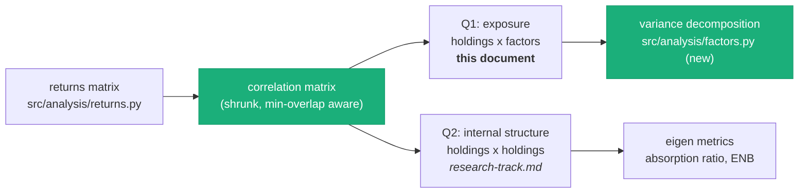
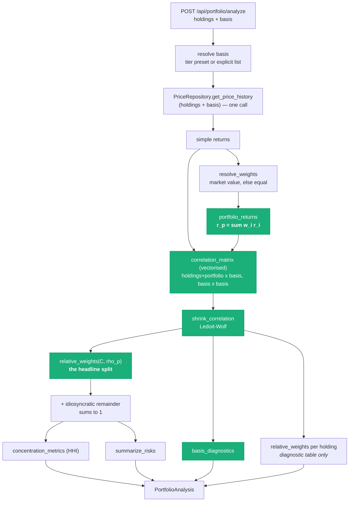

# Correlation Engine Buildout — Portfolio Correlations, and a Factor Basis Beyond Four Anchors

**Status:** Proposal. Nothing here is built. §10 lists the decisions needed before it is
implementable.

**What this is.** A plan for turning the correlation engine from *"one anchor against many
satellites"* into *"an arbitrary portfolio against an arbitrary factor basis"* — and for growing
that basis from today's four anchors to a dozen or more without the maths quietly degrading.

**Companion documents:**
- [track-a-phase-3-portfolio-analysis.md](track-a-phase-3-portfolio-analysis.md) — what shipped.
  This document supersedes its §4 maths and §8 limitations.
- [research-track.md](research-track.md) — the *N×N within-portfolio* workspace. Different
  question (see §1); this plan is a hard prerequisite for it.
- [correlation-mechanism.md](../backend_docs/correlation-mechanism.md) — the existing primitives.
- [track-a-product-plan.md](track-a-product-plan.md) — the write/read separation this must respect.

---

## 1. Two different questions, one engine

The word "portfolio correlation" covers two questions that need different machinery. Being
explicit about which is which is the first design decision, because the codebase currently has a
partial answer to one and no answer to the other.

| | **Q1 — Exposure** | **Q2 — Internal structure** |
|---|---|---|
| Question | *What drives my portfolio?* | *How much is my portfolio one bet?* |
| Shape | holdings × factors (`H × A`) | holdings × holdings (`H × H`) |
| Output | a variance split that sums to 1 | absorption ratio, ENB, risk contributions |
| Built? | **Yes — Phase 3, with defects (§2)** | No — [research-track.md](research-track.md) §2 |
| Needs weights? | Yes | Yes, differently |
| Needs a basis? | **Yes — this is the scaling problem** | No |

This document is about **Q1**. It touches Q2 only where the shared plumbing belongs in one place:
both need a returns matrix, a correlation matrix with honest small-sample handling, and a variance
decomposition. Building that plumbing once, properly, is most of the work here — and it is what
makes the research track cheap later instead of a second parallel implementation.



---

## 2. Audit — what has to change before the basis widens

Five defects. Four of them are *invisible at four anchors and severe at twelve*, which is why
widening the basis is not the one-line config change
[track-a-phase-3-portfolio-analysis.md §1](track-a-phase-3-portfolio-analysis.md) says it is. Every
number below was measured, not estimated; the scripts are reproduced in §9.

### D1 — The roll-up aggregates in share-space, not exposure-space ⚠️ *the serious one*

`aggregate_exposure` (`src/analysis/portfolio.py:132`) computes `Σᵢ wᵢ · shareᵢₐ` — a weighted
average of per-holding variance *shares*. The Phase 3 doc calls this "exact only if holdings have
equal volatility." That understates it: **it is biased even when every holding has identical
volatility**, because it ignores that idiosyncratic risk diversifies away across positions while
factor risk does not.

Take *n* identical holdings, each correlated `ρ` with one factor, residuals independent, equal
weights. Every holding has R² = ρ², so the roll-up reports ρ² regardless of *n*. The portfolio's
actual factor share is `ρ² / (ρ² + (1−ρ²)/n)`:

| ρ | n | Reported | Actual | Error |
|---|---|---|---|---|
| 0.4 | 10 | 16% | 66% | −50pp |
| 0.5 | 10 | 25% | **77%** | −52pp |
| 0.5 | 25 | 25% | 89% | −64pp |
| 0.7 | 10 | 49% | 91% | −42pp |

The error grows with the number of holdings and **always understates concentration** — in a
feature whose entire purpose is flagging concentration, and whose `CONCENTRATION_ALERT_SHARE = 0.4`
threshold sits right in the middle of that gap. A ten-name portfolio of chip stocks is reported as
diversified.

This is independent of the number of anchors, so it is not *caused* by the basis being small — but
it must be fixed first, because the fix (§3.2) is also the only aggregation that stays correct as
the basis grows.

### D2 — Pratt's measure plus negative-clipping does not survive a wider basis

`factor_attribution` uses Pratt's measure (`βₐ · ρₐ`) and `_clip_to_total`
(`src/analysis/portfolio.py:120`) drops negative contributions and rescales the survivors. The
Phase 3 doc frames clipping as an edge case for "holdings with sign-flipping regression
coefficients." Measured over 2,000 simulated portfolios (T = 250 daily observations, mutually
correlated factors), it is not an edge case, and it degrades fast:

| Anchors | Any negative | >5% of R² clipped | Median share of R² reallocated | Median cond(C) |
|---|---|---|---|---|
| **4** | 79% | 15% | **2.5%** | 3.7 |
| 8 | 100% | 83% | 8.0% | 7.3 |
| 12 | 100% | 99% | **13.2%** | 11.5 |
| 20 | 100% | 100% | 23.6% | 21.7 |
| 30 | 100% | 100% | **35.7%** | 38.5 |

At four anchors, clipping moves ~2.5% of the explained variance around — genuinely negligible, and
the current code is defensible. At twelve it moves 13%, at thirty it moves 36%. The pie stops being
a decomposition and becomes an artifact of the clipping rule.

Concretely, with two anchors 0.75-correlated and a holding at ρ = [0.70, 0.20]:

| | Anchor 1 | Anchor 2 | Sum |
|---|---|---|---|
| Pratt, raw | 0.880 | **−0.149** | 0.731 (= R²) |
| Pratt, after `_clip_to_total` | **0.731** | **0.000** | 0.731 |
| Relative weights (§3.3) | **0.591** | **0.141** | 0.731 (= R²) |

Clipping reports the second anchor as explaining *nothing*, when a non-negative decomposition of
the same R² gives it 19% of the explained variance.

Two secondary points on the Phase 3 doc's framing while here: the docstring claim that Pratt "is
the only additive decomposition that sums exactly to R-squared" is false — LMG/Shapley
(Lindeman–Merenda–Gold 1980) and relative weights (Genizi 1993, Johnson 2000) both do, and both are
non-negative by construction. Pratt is unique only under *Pratt's own axioms*. And negativity under
suppression is the long-known defect of βr (Darlington 1968), not a novel finding.

### D3 — The correlation matrix is built with a Python loop over pairs

`PortfolioService._correlation_matrix` (`src/services/portfolio_service.py:141`) calls
`compute_correlations` once per anchor, which itself loops over holdings doing `pd.concat` +
`dropna` per pair — `H × A` DataFrame constructions. Reusing that function was the right call for
*semantic* consistency (pair alignment, the 30-day minimum overlap), but it does not scale:

| Holdings × Anchors | Current loop | `df.corr(min_periods=30)` | Speedup |
|---|---|---|---|
| 50 × 4 | 90 ms | 1.2 ms | 77× |
| 50 × 30 | **640 ms** | 2.1 ms | 301× |
| 50 × 60 | 1,250 ms | 3.8 ms | 327× |

Identical results to 2×10⁻¹⁶. At four anchors the 90 ms is invisible next to the price fetch; at
thirty it is most of the request budget, and it is *pure waste* — pandas already does exactly this
computation pairwise-complete in C.

### D4 — No shrinkage: the anchor matrix `C` is a raw sample estimate

`_anchor_matrix` (`src/services/portfolio_service.py:178`) is `returns[anchors].corr()` with NaN → 0.
With T ≈ 250 trading days, the number of parameters in `C` grows as `A²/2` while the data does not.
Drawing from *genuinely independent* factors:

| Anchors | Pairs in C | Median largest spurious \|r\| |
|---|---|---|
| 4 | 6 | 0.10 |
| 12 | 66 | 0.16 |
| 30 | 435 | 0.20 |
| 60 | 1,770 | 0.22 |

That noise enters the decomposition through `C⁻¹`, where it is amplified — the cond(C) column in D2
is the same phenomenon. This is exactly what Ledoit–Wolf shrinkage exists for, and it is already
flagged as needed in [research-track.md](research-track.md) §4.4 (`shrink_covariance`), just never
built.

### D5 — The basis is not spanning, and the persisted schema can't hold a wider one

Two structural facts, both already half-acknowledged elsewhere:

- **NVDA, AAPL, TSM, ASML are three semiconductor names and one megacap.** They are *themes*, not a
  spanning basis. A healthcare-and-banks portfolio correctly comes back ~90% Unexplained
  ([Phase 3 §1](track-a-phase-3-portfolio-analysis.md)) — the answer is honest, but the product is
  not useful for most portfolios. There is also no market factor: `config.market_proxy_ticker`
  (`^GSPC`) exists and Phase 4's partial correlation uses it, but the portfolio path does not, so
  common market beta is currently attributed to whichever anchor happens to carry it.
- **`CorrelationRow` is keyed `(anchor, satellite, lookback_days, computed_at)`**
  (`src/repositories/postgres/models.py:60`). [research-track.md §4.1](research-track.md) argued —
  with a stated deadline — for a symmetric `(ticker_a, ticker_b)` pair table instead, and that
  advice was not taken before Phase 1 shipped. So the table can express *anchor→satellite* rows and
  nothing else. §5 covers what that costs now.

---

## 3. Target design

### 3.1 One decomposition module, three primitives

```
src/analysis/correlation.py     EXTEND
    correlation_matrix(returns, min_overlap=MIN_OVERLAP_DAYS, method="pearson") -> DataFrame
        # vectorised replacement for the per-pair loop (D3); pairwise-complete,
        # min_periods-aware, same semantics as compute_correlations. The existing
        # per-pair functions stay — the satellite pipeline's diagnostics need them.
    shrink_correlation(corr, n_obs) -> tuple[DataFrame, float]
        # Ledoit-Wolf constant-correlation target; returns the matrix and the
        # shrinkage intensity so the API can report it (D4).

src/analysis/factors.py          NEW — pure maths, no I/O
    relative_weights(C, rho) -> ndarray          # Genizi/Johnson (D2)
    r_squared(C, rho) -> float
    decompose(C, rho, method="relative_weights") -> FactorSplit
    portfolio_returns(returns, weights) -> Series # exposure-space aggregation (D1)
    basis_diagnostics(C, n_obs) -> BasisHealth    # cond, shrinkage, T/A, max |off-diag|

src/analysis/portfolio.py        SHRINK
    # keeps resolve_weights, concentration_metrics, summarize_risks.
    # factor_attribution / _clip_to_total / aggregate_exposure move to factors.py
    # and change shape. IDIOSYNCRATIC stays here — the API and frontend depend on it.
```

`factors.py` staying pure (arrays in, arrays out, no config, no repositories) matches how
`analysis/portfolio.py` is written today and is what keeps the 19 existing maths tests meaningful.

### 3.2 Fixing the roll-up: decompose the portfolio, don't average the holdings

The fix for D1 is not a better weighted average. It is to stop averaging:

> **Build the portfolio's own return series `r_p,t = Σᵢ wᵢ · rᵢ,t`, then run one decomposition on
> it.** The per-holding attributions become a diagnostic table, not the input to the roll-up.

This is exact. It needs no volatility model, no covariance model, and no assumption about residual
independence — all of that information is already in the return series. Verified against the D1
scenarios (T = 20,000):

| Scenario | Current roll-up | **Portfolio-series R²** | Closed form |
|---|---|---|---|
| ρ=0.5, n=10 | 0.250 | **0.767** | 0.769 |
| ρ=0.4, n=25 | 0.160 | **0.827** | 0.826 |
| ρ=0.7, n=5 | 0.490 | **0.828** | 0.828 |

It also *removes* rather than adds work: one `A`-dimensional solve instead of `H` of them for the
headline number, and it deletes the "equal volatility" caveat from the docs and the API contract.

Two implementation notes:

- **Weight simple returns, then log.** `compute_log_returns` produces log returns, which do not
  aggregate linearly across assets — `Σ wᵢ log(1+rᵢ) ≠ log(1 + Σ wᵢ rᵢ)`. Measured at daily
  frequency over a year this shifts the portfolio-factor correlation by ~0.001, so it is
  cosmetically negligible, but the correct order (`expm1 → weight → log1p`) costs one line and
  removes a caveat rather than documenting one.
- **Unsized portfolios still work.** `resolve_weights`' equal-weight fallback
  (`src/analysis/portfolio.py:53`) is unchanged and feeds this the same way.

### 3.3 Fixing the split: relative weights instead of Pratt-plus-clipping

Replace `factor_attribution` + `_clip_to_total` with the Genizi/Johnson relative-weights
decomposition, which is **non-negative by construction** and still sums exactly to R²:

1. Eigendecompose the factor correlation matrix `C = P D Pᵀ`, and form `Λ = C^½ = P D^½ Pᵀ`.
   `Λ` is the loading of each factor on an orthogonal basis maximally similar to the original one.
2. Regress the target on that orthogonal basis: `β* = Λ⁻¹ ρ`. Because the basis is orthonormal,
   `R² = Σₖ β*ₖ²`.
3. Allocate back: `εₐ = Σₖ Λₐₖ² β*ₖ²`.

Since `Λ` is symmetric, each column's squared entries sum to `C_aa = 1`, so `Σₐ εₐ = R²` exactly —
the same guarantee Pratt gives, without the negatives. Cost is one `A×A` eigendecomposition:
microseconds at A = 30, and it *replaces* a per-holding `lstsq`.

Two properties worth stating in the docs, because they matter for how the number reads:

- **It agrees with Pratt where Pratt is well-behaved.** On the Phase 3 worked example
  (C = [[1,.9],[.9,1]], ρ = [.8,.8]) both give exactly [0.3368, 0.3368]. The existing test
  `test_correlated_anchors_do_not_double_count_the_same_variance` passes unchanged, and the
  double-counting argument in [Phase 3 §4.2](track-a-phase-3-portfolio-analysis.md) survives intact
  — this changes the estimator, not the story.
- **Why not LMG/Shapley**, the other non-negative choice: it averages R² increments over all `2^A`
  predictor orderings. Fine at A = 4 (16 subsets), impossible at A = 20 (a million). Relative
  weights is `O(A³)` and is the right choice *precisely because* the basis is going to grow. If the
  basis were permanently four, LMG would be the more standard pick.

### 3.4 Conditioning: shrinkage, and a basis-health readout

- Apply **Ledoit–Wolf shrinkage** to `C` toward a constant-correlation target before inverting
  (Ledoit & Wolf 2003/2004). At A = 4 the intensity will be near zero and nothing changes; the
  point is that it scales itself as the basis widens.
- Keep the `pinv`/`lstsq` minimum-norm behaviour as a second line of defence for genuinely
  collinear factors.
- **Return the diagnostics rather than hiding them.** `basis_diagnostics` yields `n_obs`,
  `n_factors`, `T/A`, `cond(C)`, shrinkage intensity, and the largest off-diagonal |r|. Surfacing
  "this basis is at the edge of what a year of data supports" is more honest than silently
  producing a confident-looking pie, and it is the guard rail that makes user-supplied `anchors`
  lists safe to expose in the UI (Phase 3 §8.6).

### 3.5 What the request path becomes



The shape of the response is unchanged (§6). What changes is that `factor_exposure` comes from one
decomposition of the portfolio rather than a weighted average of fifty, and the per-holding rows are
labelled as what they are.

---

## 4. Scaling the basis beyond four anchors

### 4.1 The observation budget

The hard constraint is `T`, not compute. `config.lookback_days = 365` calendar days ≈ **250 trading
days**, and `C` has `A(A−1)/2` free parameters.

| Basis size A | T/A at 365d | T/A at 3y (750d) | Verdict at 365d |
|---|---|---|---|
| 4 | 63 | 188 | Comfortable |
| 12 | 21 | 63 | **Fine with shrinkage** |
| 20 | 13 | 38 | Workable, shrinkage load-bearing |
| 30 | 8 | 25 | Needs a longer lookback |
| 60 | 4 | 13 | Not supportable |

Rule of thumb to encode in `basis_diagnostics`: warn below `T/A = 15`, refuse above `A = T/5`.
Lengthening the lookback buys basis width at the cost of responsiveness — a 3-year window averages
across regimes, which directly fights Phase 4's regime-break work. **Recommendation:** keep 365 days
as the default and cap the basis at ~15, rather than widening the window.

### 4.2 The tiers

Widening the basis is not one change — it is three, in increasing order of both value and cost.

| Tier | Basis | A | What it buys | Cost |
|---|---|---|---|---|
| **0** | NVDA, AAPL, TSM, ASML | 4 | *(today)* | — |
| **1** | `^GSPC` + the 4 anchors | 5 | **Separates market beta from anchor-specific exposure.** Removes Phase 3 §8.5. | Config + a fixed ordering rule (§4.3). Days. |
| **2** | Market + ~10 sector ETFs, anchors as overlays | 11–15 | **Every equity portfolio gets a meaningful answer**, not just chip-adjacent ones. This is what makes the feature general. | The real work: basis config, precompute, UI labelling. |
| **3** | Statistical factors (PCA on a broad universe), anchors as named themes | ~5–8 PCs | Orthogonal by construction; absorption ratio falls out free and connects to the research track. | Factors have no names. Needs an interpretation layer. |

Tier 2 is the recommended destination. Concretely: `^GSPC` plus the sector SPDRs (XLK, XLF, XLV,
XLY, XLP, XLE, XLI, XLB, XLU, XLRE), with `SOXX` retained because semiconductors are this app's
identity and `sector_etf_for` (`src/analysis/correlation.py:24`) already maps to it. That is A = 12,
T/A = 21, and it is a genuine *spanning* basis for US equities rather than four correlated names.

### 4.3 Themes are not factors — the two-block basis

A subtlety that determines whether Tier 2 reads well: NVDA is not a peer of "Technology." It is
mostly Technology plus a chip-specific residual. If both are in a flat basis, relative weights will
split their shared variance evenly between them, and the user is told "your portfolio is 20% Tech
and 20% NVDA," which double-names one exposure even though the arithmetic is sound.

The fix is to make the hierarchy explicit rather than let the estimator guess it:

1. **Block 1 — the spanning basis.** Market, then sectors orthogonalised against the market.
   Decompose against this. Every share here is a real, non-overlapping share of variance.
2. **Block 2 — theme overlays.** Anchors orthogonalised against block 1 (regress out, keep the
   residual). Each anchor's reported number becomes *"exposure to NVDA beyond what its sector
   already explains"* — which is both the more interesting statement and the one that stays
   comparable across portfolios.

This is Gram–Schmidt in a *deliberately chosen order*, and it is the same idea Phase 4's partial
correlation already applies at the pair level (`compute_partial_correlations`,
`src/analysis/correlation.py:93`) — lifted from one pair to a whole basis. It also makes the ordering
an explicit, documented product decision rather than an emergent property of the estimator.

### 4.4 Configuration

`config.yaml` grows a factor-basis section; `anchors` stays exactly as it is, since the graph
pipeline depends on it and the two concepts are now genuinely different things:

```yaml
factor_bases:
  default: sectors                 # which preset the API uses when `basis` is omitted
  presets:
    anchors:                       # Tier 0 — today's behaviour, kept for compatibility
      spanning: []
      themes: [NVDA, AAPL, TSM, ASML]
    market_anchors:                # Tier 1
      spanning: ["^GSPC"]
      themes: [NVDA, AAPL, TSM, ASML]
    sectors:                       # Tier 2 — the recommended default
      spanning: ["^GSPC", XLK, XLF, XLV, XLY, XLP, XLE, XLI, XLB, XLU, XLRE, SOXX]
      themes: [NVDA, AAPL, TSM, ASML]
  max_factors: 15                  # refuse past this; see §4.1
  min_observations_per_factor: 15  # warn below this
```

Two-block structure in the config means §4.3's ordering is data, not code. `max_factors` is the
guard rail that makes the existing `anchors` request field (Phase 3 §8.6) safe to wire into the UI.

---

## 5. Data and persistence

### 5.1 Keep computing live — but precompute the basis

[Phase 3 §3](track-a-phase-3-portfolio-analysis.md) decided to compute portfolio correlations live
rather than read the `correlations` table, and that decision holds up: real portfolios are large
caps the satellite table does not cover, and its Spearman figures are not a coherent input to a
Pearson variance decomposition. Nothing in this plan changes that.

What *does* change is the basis side. At A = 12, `C` is a 12×12 matrix over a fixed, known set of
tickers — recomputed identically on every single request. It should be computed once by the daily
job and stored, alongside its shrinkage intensity and conditioning:

```
factor_bases(
    basis_name, as_of_date, lookback_days,
    tickers          jsonb,        -- ordered: spanning block, then themes
    correlation      jsonb,        -- the A x A matrix, post-shrinkage
    shrinkage_intensity, condition_number, n_obs,
    computed_at,
    PRIMARY KEY (basis_name, as_of_date, lookback_days)
)
```

This fits the existing write/read separation exactly — a new job step in
`_run_daily_correlation_refresh` (`src/cli.py`), a `FactorBasisRepository` Protocol in
`src/repositories/base.py` next to `CorrelationRepository`, and a Postgres implementation beside the
three that exist. Per-request work drops to fetching holdings prices and one solve.

`as_of_date` is separated from `computed_at` here deliberately — the point
[research-track.md §4.1](research-track.md) made about the correlations table, applied to the one
schema still being designed rather than the one already shipped.

### 5.2 The pair-table decision, revisited

`CorrelationRow` shipped as `(anchor, satellite)` (D5). The research track's `(ticker_a, ticker_b)`
recommendation is still correct for Q2, but the cost of acting on it has changed now that the table
exists and a daily job writes to it. Three options, in the order I'd rank them:

| Option | Cost | When it's right |
|---|---|---|
| **Leave it. Add `pair_correlations` as a second table when Q2 is built.** | Low. Two tables with different purposes and no migration. | **Recommended.** The anchor→satellite table serves the graph; it is not a degenerate pair table trying to be one. |
| Migrate `correlations` to a pair table now | One Alembic migration + rewrites of `CorrelationRepository`, `GraphService`, and the graph serializers | Only if Q2 lands imminently |
| Do nothing, ever | Free now | Only if Q2 is dropped |

Either way this is **not blocking** for anything in §3 or §4 — the portfolio path does not read
either table. Flagging it so the earlier recommendation is closed out rather than left dangling.

### 5.3 Price coverage is the real cost, and it already works

Compute is cheap; **data acquisition is not**. The good news is that the plumbing is already in
place: `PostgresPriceRepository._ensure_company_placeholders`
(`src/repositories/postgres/price_repository.py:109`) inserts a minimal `companies` row for any
unknown ticker, so an arbitrary pasted symbol persists its prices on first sight and is a warm cache
read afterward. `MAX_HOLDINGS = 50` and the 20/min rate limit bound the fan-out.

Two additions:

- **Pin the basis tickers into the daily refresh set.** They are needed on every request; they
  should never be a cache miss on the request path.
- **Learn from user data** (research-track's suggestion, applicable now without auth): have the
  daily job refresh every ticker with recent price rows, so any symbol anyone has looked up stays
  warm. The expensive tier is then only ever hit the *first* time a ticker is seen.

---

## 6. API contract

Backward compatible. `PortfolioAnalyzeRequest` gains an optional `basis`; `anchors` keeps working as
a synonym for an explicit theme list, so the shipped frontend needs no change to keep functioning.

```jsonc
// request
{ "holdings": [...],
  "basis": "sectors",        // preset name, or null for config default
  "anchors": null }          // still honoured: explicit factor list, capped at max_factors

// response — additions only
{
  "factor_exposure": [ { "factor", "label", "share", "is_idiosyncratic",
                         "block": "spanning" | "theme" } ],   // NEW: block
  "basis": { "name": "sectors", "factors": [...], "block_sizes": {...} },  // NEW
  "diagnostics": {                                                         // NEW
    "n_observations": 249, "n_factors": 12, "observations_per_factor": 20.8,
    "condition_number": 8.4, "shrinkage_intensity": 0.12, "max_off_diagonal": 0.71,
    "warnings": []
  },
  "holdings": [ { ..., "r_squared", "attribution": {...} } ],  // now explicitly a diagnostic
  "method": "relative_weights"                                  // NEW: provenance
}
```

`method` is worth carrying explicitly: the numbers change when this ships, and a stored or exported
analysis should say which estimator produced it.

**Frontend consequences** (deferred to its own phase, listed so they aren't a surprise): the donut
needs to handle 12–15 slices rather than 5 — almost certainly meaning "spanning block as the donut,
themes as a ranked bar list beneath" rather than one flat pie; `PortfolioHeatmap` becomes
holdings × 12 and needs horizontal scroll; `portfolioStyle.ts`'s sequential ramp needs enough
distinguishable steps; and the sector-ETF factor labels will collide with the graph's sector colour
semantics, which is exactly the collision
[Phase 3 §7](track-a-phase-3-portfolio-analysis.md) chose the sequential ramp to avoid.

---

## 7. Performance budget

Per request, H = 50 holdings, A = 12, T = 250, basis matrix precomputed:

| Step | Now (A=4) | After (A=12) |
|---|---|---|
| Price fetch, warm cache | ~50 ms | ~50 ms |
| Log returns | ~5 ms | ~5 ms |
| Holdings × basis correlations | 90 ms → *would be 260 ms at A=12* | **~2 ms** (vectorised) |
| Basis matrix `C` | ~2 ms | **0 ms** (precomputed) |
| Shrinkage | — | <1 ms |
| Decomposition | 50 × `lstsq(4)` | 1 × `eigh(12)` + 50 diagnostic solves ≈ 3 ms |
| **Total, warm** | **~150 ms** | **~65 ms** |

Tripling the basis makes the endpoint *faster*, because D3's loop dominates everything else. Cold
cache remains dominated by yfinance and is unchanged.

---

## 8. Phasing

Each phase is independently shippable and independently valuable. **Phase A is the only one that
changes numbers users have already seen** — it should ship with a note in the UI.

### Phase A — Correctness at the current basis *(no basis change)*
1. `src/analysis/factors.py` with `relative_weights`, `r_squared`, `portfolio_returns`.
2. `PortfolioService` decomposes the portfolio series (§3.2); per-holding attribution becomes a
   diagnostic and switches to relative weights (§3.3). Delete `_clip_to_total`.
3. Weight simple returns before logging (§3.2).
4. `method: "relative_weights"` in the response.
- **Test:** the existing 19 maths tests stay, plus the D1 table as a regression test (n identical
  holdings must report the closed-form share, not ρ²) and the suppression case from D2.
- **Milestone:** a 10-name chip portfolio reports ~77%, not 25%, on the same anchors.

### Phase B — Engine performance and conditioning *(no user-visible change)*
5. `correlation_matrix` vectorised primitive; `PortfolioService` uses it (D3).
6. `shrink_correlation` + `basis_diagnostics`; `diagnostics` block in the response (D4).
- **Test:** vectorised vs loop equivalence to 1e-12 on the existing fixtures; shrinkage intensity
  ≈ 0 at A = 4 so Phase A's numbers do not move.
- **Milestone:** 50 × 30 matrix in single-digit ms; every response carries a basis-health readout.

### Phase C — Tier 1, the market factor
7. `factor_bases` config with two-block presets; `basis` request field; `max_factors` guard.
8. Themes orthogonalised against the spanning block (§4.3).
- **Milestone:** `^GSPC` appears as its own slice; anchor shares drop and now mean
  *"beyond market beta"*. Closes Phase 3 §8.5.

### Phase D — Tier 2, the sector basis
9. Sector-ETF basis as the default; basis tickers pinned into the daily refresh set.
10. `factor_bases` table + `FactorBasisRepository` + daily job step (§5.1).
11. Frontend: split donut/bar layout, wider heatmap, block-aware labelling (§6).
- **Milestone:** a portfolio of banks and healthcare returns a meaningful decomposition instead of
  90% Unexplained. This is the phase that makes the feature general.

*Tier 3 (statistical factors) is deliberately out of scope here — it belongs with the research
track's eigen-metrics, since PCA on the returns matrix produces both.*

---

## 9. Reproducing the numbers

Every measured figure in §2 and §3.2 comes from three short scripts (simulation, T = 250 daily
observations unless stated, seeded). They should land in `tests/` as property tests rather than
one-off scripts — specifically:

- **D1 / §3.2** — closed form `ρ²/(ρ² + (1−ρ²)/n)` vs both roll-ups. Becomes
  `test_rollup_recovers_closed_form_factor_share`.
- **D2** — clipped share of R² across basis widths. Becomes
  `test_relative_weights_never_negative` plus a fixed-input comparison against the Pratt table.
- **D3** — loop vs vectorised equivalence and timing. Equivalence as a test; timing as a benchmark.
- **D4** — largest spurious off-diagonal under a true identity `C`. Becomes a shrinkage sanity test:
  shrinkage intensity must rise with A at fixed T.

---

## 10. Decisions needed

| # | Question | Why it matters | My recommendation |
|---|---|---|---|
| **Q1** | Ship Phase A knowing published numbers change materially? | A 10-name portfolio goes from "25% NVDA" to "77% NVDA". Anyone who saw the old number will notice. | **Yes, and say so in the UI.** The old number is wrong in the direction that matters. ⚠️ *blocking Phase A* |
| **Q2** | Target basis — Tier 1, Tier 2, or Tier 3? | Determines whether this is a week or a month, and whether the app stays chip-focused. | **Tier 2.** Tier 1 alone leaves most portfolios unexplained. ⚠️ *blocking Phase C* |
| **Q3** | Do anchors remain factors at all once sectors exist? | Two-block (§4.3) keeps them as *themes beyond sector*. Dropping them is simpler but loses the app's identity. | **Keep as themes.** It's the differentiated statement. ⚠️ *blocking Phase C* |
| **Q4** | Lookback: keep 365 days, or lengthen for a wider basis? | 3 years supports A ≈ 30 but averages across regimes and fights Phase 4. | **Keep 365, cap A at 15.** |
| **Q5** | Migrate `correlations` to a pair table now? (§5.2) | Cheap to defer, expensive to do twice. | **Defer.** Add a second table with Q2. |
| **Q6** | Expose basis selection in the UI, or config-only? | The API field exists and is untested in the UI (Phase 3 §8.6). `max_factors` makes it safe. | **Preset dropdown only** — not a free-text ticker list. |
| **Q7** | Per-holding attribution: keep in the response? | It's a diagnostic after §3.2, and the heatmap already shows raw correlations. | **Keep, relabelled.** It's how a user checks the headline. |

---

## 11. References

**Variance decomposition with correlated predictors**
- Pratt, J. W. (1987). *Dividing the indivisible: using simple symmetry to partition variance
  explained.* Proc. 2nd Int. Tampere Conf. in Statistics. — the current method.
- Darlington, R. B. (1968). *Multiple regression in psychological research and practice.*
  Psychological Bulletin 69(3). — the negativity critique that D2 measures.
- Genizi, A. (1993). *Decomposition of R² in multiple regression with correlated regressors.*
  Statistica Sinica 3(2), 407–420. — the estimator §3.3 adopts.
- Johnson, J. W. (2000). *A heuristic method for estimating the relative weight of predictor
  variables in multiple regression.* Multivariate Behavioral Research 35(1). — same measure,
  the standard reference and algorithm.
- Lindeman, Merenda & Gold (1980). *Introduction to Bivariate and Multivariate Analysis.* — LMG /
  Shapley, the `2^A` alternative rejected in §3.3.
- Grömping, U. (2007). *Estimators of relative importance in linear regression based on variance
  decomposition.* The American Statistician 61(2). — the survey that compares all of the above;
  the single best citation for this section.
- Johnson & LeBreton (2004). *History and use of relative importance indices in organizational
  research.* Organizational Research Methods 7(3).

**Covariance estimation**
- Ledoit, O. & Wolf, M. (2003). *Improved estimation of the covariance matrix of stock returns with
  an application to portfolio selection.* J. Empirical Finance 10(5). — §3.4.
- Ledoit & Wolf (2004). *A well-conditioned estimator for large-dimensional covariance matrices.*
  J. Multivariate Analysis 88(2).
- Marchenko & Pastur (1967). — the eigenvalue-distribution result behind the D4 table.

**Portfolio risk attribution (the finance-side framing)**
- Litterman, R. (1996). *Hot Spots and Hedges.* Goldman Sachs. — Euler/marginal contributions to
  risk; the standard alternative framing, and where this lands if a full covariance model is ever
  built.
- Grinold, R. & Kahn, R. (1999). *Active Portfolio Management*, ch. 3. — factor risk models.
- Meucci, A. (2009). *Managing Diversification.* Risk 22(5). — effective number of bets. **Note:**
  Meucci's ENB is entropy over the eigenvalues of the covariance matrix; `effective_factors = 1/HHI`
  (`src/analysis/portfolio.py:152`) is the participation-ratio analogue over factor *shares*, which
  is a defensible concentration index but is **not** Meucci's measure. The "independent bets"
  wording in `summarize_risks` borrows his language and should be qualified.
- Kritzman, Li, Page & Rigobon (2011). *Principal Components as a Measure of Systemic Risk.*
  J. Portfolio Management 37(4). — absorption ratio; Tier 3 and the research track.
