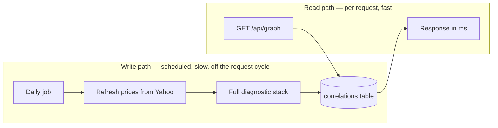

# Next Steps — Where This Application Goes From Here

**Purpose:** a menu and a decision framework, not a fixed sequence. The infrastructure
phase is essentially finished; what follows are genuine choices about product direction and
technical depth, with enough analysis of each to choose deliberately.

**Companion documents:**
- [what-has-been-built.md](what-has-been-built.md) — the record of how we got here.
- [universe-roadmap.md](../backend_docs/universe-roadmap.md) — the full Phase 7 design (dynamic universe).
- [target-architecture.md](../prod_roadmap/target-architecture.md) — the end-state topology.

---

## 1. Honest assessment of where the project stands

**What's genuinely strong.** The layering is real, not decorative: `Protocol`-based
repositories meant swapping parquet for Postgres touched exactly one conditional. The
analytics have actual depth — partial correlation to strip market beta, rolling-window
stability, lagged cross-correlation, regime detection — which is well beyond the "called an
API and drew a chart" tier. The deployment pipeline enforces migrate-before-deploy for a
documented reason. Postgres repository tests run against real Postgres in CI, which is why
the bound-parameter bug got caught.

**Where it's thin.** Three things stand out to anyone reading the repo critically:

1. **Every graph request recomputes everything.** Nothing is precomputed or persisted. The
   entire analytic stack runs live, per request. This is the single biggest gap between
   "impressive prototype" and "well-engineered system."
2. **Nothing runs on a schedule.** Data refreshes lazily when someone happens to ask. A
   production data application has a heartbeat.
3. **The product doesn't yet answer "so what?"** The graph is interesting to look at. It
   does not yet tell a user something actionable about *their* situation.

Those three frame everything below.

---

## 2. Tier 0 — Finish what's in flight

Cheap, and they close loops that are currently half-open.

| Item | Effort | Why now |
|---|---|---|
| **Merge the Sentry PR**, then set `SENTRY_DSN` in the Render dashboard | minutes | Without the env var the code is inert — the PR alone changes nothing in production |
| **Merge the frontend-tests PR** | minutes | 7 unit + 2 smoke tests from a baseline of zero |
| **Add a frontend job to `ci.yml`** | ~1 hour | ⚠️ Those new tests **run nowhere automatically.** Vercel deploys on merge regardless of whether they pass. This is the most glaring hole in the pipeline right now |
| **Sentry on the frontend** | ~1 hour | Backend errors are now visible; user-facing JS errors still aren't |
| **Fix stale doc links** in root `README.md` | minutes | Points at pre-reorg flat `docs/*.md` paths |

The frontend CI job is the one that matters. A test suite nothing runs is worse than no
test suite, because it creates false confidence.

---

## 3. Tier 1 — The foundation that unlocks most features

These two are prerequisites for a surprising amount of what follows. If you only do one
section of this document, do this one.

### 3.1 Persist computed correlations

**The problem.** `GET /api/graph` runs the full analytic stack on every cold request:
fetch prices for ~59 tickers, compute log returns, Pearson, partial correlation against
`^GSPC`, rolling stability windows, lagged cross-correlation, and regime detection —
per anchor. On a free-tier instance after spin-down, this is the slow first load you've
already noticed.

**The fix.** A `correlations` table, written by a scheduled job, read by the API.

Sketch of the table — the analytics already produce every one of these fields:

| Column | Note |
|---|---|
| `anchor`, `satellite` | composite key with `computed_at` |
| `pearson_r`, `partial_r` | raw and market-adjusted |
| `stability_score` | rolling-window consistency |
| `best_lag`, `lag_correlation` | lead/lag profile |
| `regime_break` | flagged by existing Phase 4 logic |
| `lookback_days`, `computed_at` | provenance — makes results reproducible and time-travel possible |

**Why this is the highest-leverage item.** It converts the product's slowest path into its
fastest; it forces the read/write separation that makes the system look designed rather
than assembled; it makes §4.2 (time-travel) nearly free, since you're now storing results
*with a timestamp*; and it's the honest prerequisite for a large universe, where
computing live simply won't be viable.

**Design decision to make deliberately:** does the API *ever* compute live, or only serve
stored rows? Recommended: serve stored rows by default, keep the live path behind the
existing `force_refresh` flag. That preserves the ability to explore ad-hoc anchors outside
the precomputed set, which the UI already supports.

### 3.2 Scheduled jobs

Two jobs on different cadences, both reusing the existing API image
([target-architecture.md §9](../prod_roadmap/target-architecture.md)):

- **Daily** — refresh prices past TTL, recompute correlations, write to the table.
- **Weekly/monthly** — rebuild the universe (only meaningful once Phase 7 lands; the
  universe is static until then).

Render Cron Jobs are the natural fit — same repo, same image, a different command. This is
also what finally retires the "backfill from my laptop" step.

**Watch for:** the daily job is a heavy Yahoo consumer. Batching and throttling discipline
matters more here than anywhere else in the system.

---

## 4. Tier 2 — Feature ideas, from a user's perspective

Ordered by my read of **value delivered per unit of effort**, with the strongest first.

### 4.1 Portfolio concentration analysis ⭐ *the "so what" feature*

**The idea.** A user pastes in their holdings. The app tells them how much of their
supposedly-diversified portfolio actually rides on a single factor.

> *"You hold 12 positions. 68% of your portfolio's variance tracks NVDA. Your three
> 'diversified' semiconductor picks move together with r > 0.8."*

**Why it's the strongest idea here.** Everything else in this app is *interesting*; this is
*useful*. It reframes the entire product from "a neat visualisation of stock correlations"
to "a tool that tells you something about your own money that you didn't know." Every
component it needs already exists — the correlation engine, the graph, the ticker
resolution. It's mostly a new view plus a modest aggregation endpoint.

**User considerations.** Holdings are sensitive. Start with **client-side only, nothing
persisted** — paste a list, get an answer, refresh and it's gone. That avoids auth entirely
and is a genuinely defensible privacy position. Persisting portfolios is where auth
(Phase 5b) becomes necessary, and that's a deliberate later step, not a prerequisite.

**Framing risk:** this shades toward financial advice. Keep the existing
correlation-≠-causation discipline and describe it as *observed historical co-movement*,
never as risk advice or a recommendation.

### 4.2 Time-travel: the graph as of a past date ⭐ *the strongest technical showcase*

**The idea.** A date slider. See the dependency graph as it stood in March 2024. Scrub
forward and watch links form, strengthen, and break.

**Why it's compelling.** It's visually striking in a way static graphs aren't, and it
answers a question the current UI can't: *is this relationship new, or has it always been
there?* A correlation that appeared six weeks ago means something very different from one
that's held for three years.

**Why it's cheap.** The `prices` table is already keyed by date. You are not acquiring new
data — you're using what you have properly. If §3.1 lands first and stores `computed_at`
with each row, historical graphs become a query rather than a computation.

**Technically it demonstrates** point-in-time correctness — a genuinely non-trivial concept
that most portfolio projects never touch, and one that finance interviews care about.
The discipline required: when computing "as of" date D, use only data available at D. No
lookahead. That constraint is the interesting part.

### 4.3 Explain-this-edge

**The idea.** Click an edge; get the evidence behind the number. A returns scatter plot, the
rolling correlation over time (is it stable or decaying?), the lag profile (does one lead
the other?), and the before/after of stripping market beta via partial correlation.

**Why it matters.** The app already computes all of this and then discards most of it into
a single number. This surfaces the reasoning. It converts a black box into something a
skeptical user can interrogate — and it directly showcases the analytical depth that's
currently invisible in the UI.

Effort is moderate and almost entirely frontend; the backend diagnostics already exist.

### 4.4 "What changed" — regime break surfacing

Phase 4 already detects regime breaks. Nothing surfaces them. A simple feed —
*"3 links weakened significantly this month"* — gives the app **news value** and a reason
to return. Static tools get visited once; something that changes gets visited weekly.

Natural extension once auth exists: email alerts on watchlist tickers.

### 4.5 Shared-satellite / anchor comparison

Which satellites do NVDA and TSM *both* pull? Overlap is a genuine supply-chain signal —
companies correlated with two independent anchors are more likely to be structurally
connected than statistically lucky. Cheap to compute from existing data, and it partially
mitigates the spurious-correlation problem by requiring corroboration.

### 4.6 Smaller wins

| Feature | Effort | Note |
|---|---|---|
| **Shareable permalinks** | low | URL state largely exists; make snapshots explicitly linkable |
| **CSV / PNG export** | low | Expected of any analysis tool; trivially demoable |
| **Event annotations** on the sparkline | low-med | Earnings dates give price moves context |
| **Watchlists** | med | Needs auth — [Phase 5b](../prod_roadmap/production-roadmap.md) |
| **Sector/industry filter** | med | Near-useless at 55 tickers; valuable after Phase 7 |
| **Onboarding / empty-state tour** | low | First-time users currently face a dense graph with no explanation of what they're looking at |

---

## 5. Tier 3 — Technical depth worth showcasing

Items chosen because they demonstrate judgement, not just effort.

### 5.1 Statistical rigor at scale — multiple-comparisons correction

With ~250 trading days, **r ≈ 0.13 is already p < 0.05.** At 55 candidates that's a
nuisance. At 2,000 (Phase 7) you will get dozens of spurious r ≥ 0.6 satellites per anchor
*by pure chance*. Implementing **Benjamini–Hochberg FDR correction** plus a hard stability
gate is the difference between a tool that's statistically defensible and one that
confidently reports noise.

This is the single most credible signal that the author understands the statistics rather
than just calling `.corr()`. It is also mandatory before the universe grows —
[universe-roadmap.md §7](../backend_docs/universe-roadmap.md) treats it as non-optional.

### 5.2 Two-stage correlation funnel

Cheap raw-Pearson pre-filter to a shortlist, full diagnostic stack only on survivors. A
clean, explainable algorithmic optimisation with a real justification (the full stack at
N=2000 is intractable). Pairs naturally with §5.1 and Phase 7.

### 5.3 Observability beyond "logs exist"

Structured JSON logging, request IDs threaded through the stack, and Sentry performance
traces on the slow endpoints. Concretely: *which* anchor's computation dominates a slow
`/api/graph`? Right now that's unanswerable without reproducing locally.

### 5.4 Phase 7 — dynamic universe

The largest remaining de-hardcoding: replace the 55-ticker list with a screener-fed
`companies` table. Fully designed already in
[universe-roadmap.md](../backend_docs/universe-roadmap.md), including the central tension
worth understanding before starting — **hand-curation currently buys thematic relevance for
free.** Pull the raw Russell 2000 and you're correlating NVDA against biotechs and REITs.
That's a behaviour change, not just a scale change.

Recommended entry point from that document: *curated-but-dynamic* — screener-sourced but
thematically constrained. Smallest step that removes hand-editing without discarding what
makes the graph coherent.

### 5.5 Deliberately deferred

Worth naming so they aren't built prematurely:

- **Redis L2 cache** — pointless on a single replica. Real trigger: multiple API replicas.
- **Auth** — only when per-user state genuinely exists (portfolios, watchlists).
- **Async SQLAlchemy** — synchronous is fine at this concurrency; churn without benefit.
- **Microservices** — no.

Knowing when *not* to add infrastructure is itself a signal worth sending.

---

## 6. How to decide — two lenses

### User lens

1. **Does it answer "so what?"** The graph is interesting; interesting isn't useful.
   §4.1 is the clearest yes.
2. **Does it give a reason to come back?** Static tools are visited once. §4.4 changes that.
3. **Does it need an account?** Anything requiring persistence pulls in Phase 5b. Prefer
   designs that defer it (client-side portfolio input) until the value is proven.
4. **Is it legible to a newcomer?** A dense force-directed graph with no explanation is
   intimidating. Onboarding is unglamorous and high-impact.
5. **Does it overstate certainty?** Correlation ≠ causation is a standing constraint. Any
   feature that implies advice needs careful framing.

### Technical lens

1. **Does it preserve the repository seam?** The `Protocol` boundary is why Postgres was
   cheap. Anything that reaches around it costs more than it appears to.
2. **New data, or better use of existing data?** The second is nearly always the better
   trade — §4.2 is the exemplar.
3. **Does it move work off the request path?** Precompute over compute-on-demand is the
   recurring theme (§3.1).
4. **Does it survive scale?** Ask "what happens at N=2000?" — it usually reveals the real
   design constraint (§5.1, §5.2).
5. **What does it cost to run?** Currently ~$0–25/month. Scheduled jobs and a larger
   universe both increase Yahoo API pressure, which is the true scarce resource, not CPU.
6. **Is it reversible?** Feature-flagged and presence-gated changes (`DATABASE_URL`,
   `SENTRY_DSN`) have been the pattern. Keep it.

---

## 7. Three coherent tracks

Rather than one ordering, here are three internally-consistent paths depending on the goal.

### Track A — "Make it a real product"
> Tier 0 → **§3.1 precomputed correlations** → **§3.2 scheduled jobs** → **§4.1 portfolio
> analysis** → §4.4 regime surfacing

The strongest overall path. Fixes the performance story, gives the app a heartbeat, then
adds the feature that makes someone actually want it. Ends with something defensible as a
product rather than a demo.

### Track B — "Maximum technical showcase"
> Tier 0 → **§3.1** → **§4.2 time-travel** → **§5.1 FDR correction** → §5.3 observability
> → §5.4 Phase 7

Optimised for depth visible to an engineering reviewer: point-in-time correctness,
statistical rigor, real observability. Less product value, more evidence of engineering
judgement.

### Track C — "Cheapest visible improvement"
> Tier 0 → **§4.3 explain-this-edge** → §4.6 permalinks + export → §4.6 onboarding

Mostly frontend, no architectural change. Surfaces analytical depth that's already built
but currently invisible. Good if time is short.

**My recommendation: Track A, with §4.2 (time-travel) folded in after §3.1** — because once
correlations are stored with a `computed_at` timestamp, time-travel is nearly free, and
it's the highest showcase-value feature in the document relative to its cost.

---

## 8. The one-paragraph version

The infrastructure phase is done and the app is live. The three things holding it back from
being genuinely well-built are that **every request recomputes everything**, **nothing runs
on a schedule**, and **the product doesn't yet tell a user anything about themselves**.
Fixing the first two is a single coherent piece of work — a `correlations` table written by
a daily job — and it happens to make the most compelling remaining feature (a historical,
scrubbable graph) nearly free. The most valuable feature to build after that is portfolio
concentration analysis, because it's the one that converts an interesting visualisation into
a useful tool. Before the universe grows to thousands of tickers, FDR correction stops being
optional. Everything else is a judgement call about how much depth versus how much product.
