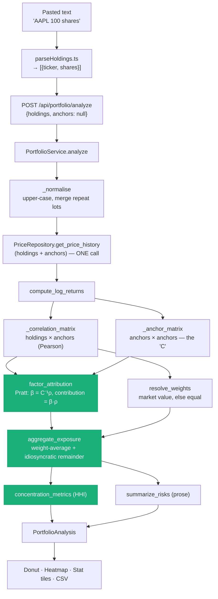

# Track A Phase 3 — Portfolio Concentration Analysis

**Branch:** `track-a-phase-3` · **Commits:** `6e0d563` (backend), `c7dc73c` (frontend)

**What it does:** a user pastes their holdings; the app answers *"of the variance in this
portfolio, how much is driven by each anchor?"* — as a donut, a correlation heatmap, a set of
concentration metrics, and a plain-language risk read-out. Nothing is persisted.

**Companion documents:**
- [correlation-engine-buildout.md](correlation-engine-buildout.md) — **supersedes §4 and §8 below.**
  Measures the defects in the maths described here and plans the engine that scales past four anchors.
- [track-a-product-plan.md](track-a-product-plan.md) §Phase 3 — the plan this executed against.
- [correlation-mechanism.md](../backend_docs/correlation-mechanism.md) — the correlation primitives reused here.
- [what-has-been-built.md](what-has-been-built.md) — deployment/infra context.

---

## 1. TL;DR — the question you asked about scope

> *Is the portfolio analysis done on only a couple of stocks? How is that set up?*

Two different sets of tickers are involved, and only one of them is small:

| | What it is | How many | Where it comes from |
|---|---|---|---|
| **Holdings** | The stocks the *user* pastes | 1–50 per request (`MAX_HOLDINGS`) | The textarea on `/portfolio` |
| **Anchors** | The *factors* holdings are decomposed against | **4 by default** | `config.yaml → anchors:` = `NVDA, AAPL, TSM, ASML` |

So the analysis runs on your whole portfolio, but it explains that portfolio using a basis of only
**four factors** — the same four anchors the rest of the app is built around. That is the real
limitation, and it is a config value, not a hard-coded one:

- `PortfolioService.analyze(holdings, anchors=None)` falls back to `self._config.anchors`.
- The API accepts an optional `anchors` list per request, so a caller can ask *"how exposed am I to
  just NVDA and TSM?"* or pass a wider set.
- **The frontend currently always sends `anchors: null`** (`PortfolioPage.tsx` → `analysis.mutate({ holdings, anchors: null })`),
  so in the shipped UI it is always the configured four. Widening the factor basis is a one-line
  config change plus a repricing of the anchor universe — no code change.
- Anchors with no usable price history are dropped before the solve, and the surviving list is
  echoed back in the response as `anchors`, so the UI never labels a factor that wasn't used.

Consequence to be honest about: with a 4-anchor basis, a portfolio of, say, healthcare and banks
will come back as ~90% **Unexplained**. That is a *correct* answer ("none of the factors we track
drive this"), not a failure — and `summarize_risks` says exactly that in words.

---

## 2. What was built

### Backend (`6e0d563`)

| File | Lines | Role |
|---|---|---|
| `src/analysis/portfolio.py` | 220 | **All the maths.** Pure functions, no I/O, no framework imports. |
| `src/services/portfolio_service.py` | 248 | Orchestration: tickers → two correlation matrices → domain models. |
| `src/api/routers/portfolio.py` | 35 | `POST /api/portfolio/analyze`, rate-limited to 20/min. |
| `src/api/schemas/portfolio.py` | 18 | Request envelope + `MAX_HOLDINGS = 50`. |
| `src/domain/models.py` | +67 | 6 new models: `PortfolioHoldingInput`, `HoldingExposure`, `UnresolvedHolding`, `FactorExposure`, `ConcentrationMetrics`, `PortfolioAnalysis`. |
| `src/api/deps.py`, `src/api/main.py` | +19 | Wiring — `get_portfolio_service`, router registration. |

Tests: **19** unit tests on the maths (`tests/test_portfolio_analysis.py`), **19** service tests
against a fake price repo (`tests/services/test_portfolio_service.py`), **12** router tests
(`tests/api/test_portfolio_router.py`) — 50 in total, all passing.

### Frontend (`c7dc73c`)

| File | Role |
|---|---|
| `src/pages/PortfolioPage.tsx` | The `/portfolio` route — form on the left, three result panels on the right. |
| `src/lib/parseHoldings.ts` | Forgiving paste parser (see §5). |
| `src/components/portfolio/HoldingsForm.tsx` | Textarea + parse preview + invalid-line feedback. |
| `src/components/portfolio/ConcentrationChart.tsx` | SVG donut **plus** a ranked bar list (a donut can't compare close values). |
| `src/components/portfolio/PortfolioHeatmap.tsx` | Real `<table>`, holdings × anchors, values printed in-cell. |
| `src/components/portfolio/FactorExposureCard.tsx` | Three stat tiles + the server's risk summary. |
| `src/components/portfolio/exportCsv.ts` | One CSV, two sections (holdings matrix, then factor split). |
| `src/components/portfolio/portfolioStyle.ts` | Sequential ramp for factors, diverging blue↔red for correlation. |
| `src/api/client.ts` | Added `apiPost` (extracted a shared `request` helper). |
| `src/api/hooks/usePortfolioAnalysis.ts` | A React Query **mutation**, not a query — never refetched against stale holdings. |

Tests: 11 parser tests, 8 CSV tests, 7 page tests, plus a Playwright spec (`e2e/portfolio.spec.ts`).

---

## 3. How a request flows



**Correlations are computed live, not read from the `correlations` table.** The plan sketched this
endpoint as a lookup against Phase 1's precomputed rows, but that table only covers the curated
small-cap *satellite* universe — real pasted portfolios are overwhelmingly large caps that aren't
in it. The fast path would miss nearly every row, and rows it *did* hit would be Spearman-ranked
figures mixed into a Pearson matrix, which isn't a coherent input to a variance decomposition.
One price fetch over (holdings + anchors) is a handful of tickers, hits the repository cache
(Postgres, with yfinance as the cache-miss fallback), and keeps every number computed the same way.

---

## 4. The maths

### 4.1 Inputs

For each holding *i*, over the trailing `lookback_days` (365) of daily **log**-returns,
inner-joined pairwise on date, with a 30-trading-day minimum overlap (`MIN_OVERLAP_DAYS`, reused
verbatim from `src/analysis/correlation.py`):

- **ρ**ᵢ — a length-4 vector of Pearson correlations against each anchor.
- **C** — the 4×4 anchor-vs-anchor Pearson correlation matrix. NaN pairs → 0 (treat as
  independent); diagonal forced to 1.

### 4.2 Why not just square the correlations

The tempting decomposition is "holding *i* is ρ²ₐ driven by anchor *a*". It is wrong here, because
the anchors are themselves correlated. NVDA and TSM move together; a semiconductor holding would be
reported as ~90% NVDA-driven **and** ~85% TSM-driven — a split summing to well over 100% of a
variance that only ever added to one. A pie built from those numbers is meaningless.

### 4.3 Pratt's measure

Regress the holding's returns on all anchors *jointly*. In standardised (correlation) form the
regression coefficients are

> **β** = **C**⁻¹ **ρ**

and the multiple coefficient of determination is

> **R²** = **ρ** · **β**  ∈ [0, 1]

Pratt's measure splits that total per anchor as

> contribution*ₐ* = β*ₐ* · ρ*ₐ*,  and  Σ*ₐ* β*ₐ*ρ*ₐ* = R²  *exactly*

This is the property that matters: it is the additive decomposition that sums to R² by
construction, so shared variance between correlated anchors is *allocated once*, not double-counted.

**Implementation details that differ from the formula on paper:**

- `np.linalg.lstsq`, not `inv`/`solve`. Same-sector anchors (NVDA/TSM/ASML) are close to collinear;
  lstsq's minimum-norm solution degrades gracefully where a direct inverse blows the coefficients up.
- An anchor a holding has too little overlap with (NaN ρ) is **excluded from the solve** for that
  row and contributes 0 — rather than poisoning the whole system with a NaN.
- **Negative contributions are clipped.** Pratt's measure can go negative under *suppression* (an
  anchor whose regression coefficient flips sign against its raw correlation). A negative "share of
  variance" is neither renderable nor meaningful to a retail user, so negatives are dropped and the
  survivors rescaled back up to the true R² (`_clip_to_total`). The **total stays honest**; only the
  split becomes approximate in that case.

Post-conditions, asserted in tests: every attribution row is non-negative and sums to that
holding's R² ∈ [0, 1].

### 4.4 Weighting

`resolve_weights` is **all-or-nothing**:

- Value weighting requires a share count **and** a usable last price for *every* holding →
  `wᵢ = valueᵢ / Σvalue`, mode `"market_value"`.
- Otherwise every position gets `1/n`, mode `"equal"`.

A portfolio where two of five positions are value-weighted and the rest guessed would silently
misstate concentration, so the mode is reported honestly rather than mixed. The UI says which mode
was used, and the risk summary nudges the user to add share counts.

### 4.5 Portfolio roll-up

> exposure*ₐ* = Σᵢ wᵢ · contribution*ᵢₐ*  
> exposure_idiosyncratic = 1 − Σ*ₐ* exposure*ₐ*

Because each row sums to its own R², the remainder is exactly the weighted mean of (1 − R²) — the
share of variance the tracked anchors don't explain. The result **sums to exactly 1**, so the
frontend renders it as a donut without re-normalising.

> **Documented approximation:** the weight-average is exact only if holdings have equal volatility.
> With unequal vols it's a first-order approximation. Pricing in per-holding vol needs a full
> covariance model — a Phase 5 concern, deliberately not smuggled in here.

### 4.6 Concentration metrics

Herfindahl index over the factor shares, **including** the idiosyncratic bucket (a portfolio whose
variance is mostly unexplained genuinely *is* less concentrated in any tracked factor):

> HHI = Σ share²  ·  effective_factors = 1 / HHI

`effective_factors` is the reader-friendly form — *"your risk behaves like roughly 2.4 independent
bets."* Also returned: `top_factor`, `top_factor_share`, `top_three_share`.

### 4.7 Thresholds (judgement calls, not statistics)

| Constant | Value | Meaning |
|---|---|---|
| `CONCENTRATION_ALERT_SHARE` | 0.40 | One factor above this gets flagged as concentration risk. |
| `DIVERSIFIED_IDIOSYNCRATIC_SHARE` | 0.60 | Above this the portfolio is "diversified w.r.t. our anchors — but may be concentrated in factors this app doesn't track." |
| `MIN_OVERLAP_DAYS` | 30 | Minimum overlapping trading days to correlate a pair at all. |
| `lookback_days` | 365 | Correlation window (`config.yaml`). |

### 4.8 Worked example

The scenario `test_correlated_anchors_do_not_double_count_the_same_variance` pins down. Two anchors
0.9 correlated with each other; a holding 0.8 correlated with both:

> **C** = [[1, 0.9], [0.9, 1]] · **ρ** = [0.8, 0.8]
>
> **β** = **C**⁻¹**ρ** = [0.421, 0.421]
> · contributions = **β**⊙**ρ** = **[0.337, 0.337]** · **R² = 0.674**

Squaring the raw correlations instead would have claimed 0.64 + 0.64 = **1.28** — 128% of a variance
that can only ever be 100%. Pratt allocates the shared chunk once: each anchor gets ~34%, and the
remaining ~33% falls through to **Unexplained**.

---

## 5. Input handling — pasted text is messy

`parseHoldings.ts` is deliberately forgiving. All of these are one holding:

```
AAPL 100 shares · AAPL, 100 · AAPL  100 · AAPL: 100 sh · 100 AAPL · AAPL
```

The rule: find the ticker-shaped token, find the number, ignore the rest.

- Thousands separators are stripped **before** comma-splitting, so `AAPL 1,250` doesn't become two lines.
- A comma-separated line splits into several holdings only when *every* part is itself valid — that
  distinguishes `AAPL, MSFT, TSM` (three holdings) from `AAPL, 100` (one).
- Currency amounts (`$12,340.00`) and percentages are stripped so a market-value column isn't read
  as a share count.
- Broker noise words (`shares`, `qty`, `total`, `cash`, `subtotal`…) are dropped — several are
  *ticker-shaped*, so without this a "Total" summary row would parse as a holding.
- Lines with no ticker-shaped token become `invalid` and are **shown back to the user**, never
  silently dropped — a skipped line would quietly change every percentage on the results screen.

Server-side, `_normalise` upper-cases, strips, and merges repeat lots (two lots of AAPL sum). If one
lot has no share count, the whole ticker degrades to "unsized" rather than reporting a total that
omits a lot. Unresolvable tickers come back in `unresolved[]` with a reason (`No price history
available`, or `Fewer than 30 trading days overlapping with the anchors`) and are listed in the UI.

---

## 6. API contract

`POST /api/portfolio/analyze` — POST despite being a pure read: the holdings list is too long for a
URL and is the user's own position data (query strings land in access logs and browser history).
Rate-limited to **20/min** (stricter than the 60/min default) because it's the one endpoint a user
can point at arbitrary symbols, making it the easiest way to drive uncached yfinance traffic.

```jsonc
// request
{ "holdings": [{ "ticker": "AAPL", "shares": 100 }], "anchors": null }

// response (PortfolioAnalysis)
{
  "anchors": ["NVDA", "AAPL", "TSM", "ASML"],
  "holdings": [{ "ticker", "shares", "last_price", "market_value",
                 "weight", "correlations": {"NVDA": 0.62, ...}, "r_squared" }],
  "unresolved": [{ "ticker": "XYZQ", "reason": "No price history available" }],
  "weighting": "market_value",   // or "equal"
  "total_value": 48210.0,
  "factor_exposure": [{ "factor", "label", "share", "is_idiosyncratic" }],  // sums to 1
  "concentration": { "herfindahl_index", "effective_factors",
                     "top_factor", "top_factor_share", "top_three_share" },
  "risk_summary": ["NVDA is your largest single exposure at 41% of portfolio variance.", ...],
  "lookback_days": 365,
  "generated_at": "2026-08-30T12:00:00Z"
}
```

Errors: `422` for an empty/oversized holdings list, non-positive share counts, or an
`InsufficientDataError` (no usable anchor / no usable holding). Holdings are returned
**largest-position-first** — sorted once server-side rather than twice in the frontend. The
idiosyncratic slice is **always last** in `factor_exposure`, whatever its size: it's a residual, and
a pie that re-sorts "everything else" into the middle reads as a peer of the named factors.

---

## 7. Design decisions worth remembering

| Decision | Why |
|---|---|
| Maths in `src/analysis/`, orchestration in `src/services/` | Every formula is unit-testable with no I/O, no fixtures, no HTTP. |
| Live correlations, not the `correlations` table | That table is the *satellite graph's* read path; portfolios are large caps it doesn't cover (see §3). |
| No persistence, no `@lru_cache` on the service | Plan §Phase 3: "No persistence." Refresh clears holdings. Saved portfolios are a Phase 5b concern that adds a `portfolio_id` + repository *without touching any of the maths*. |
| Mutation, not query, in React Query | The result must never be refetched or cached against a holdings list the user has since edited. |
| Sequential ramp for factors, not the categorical palette | Categorical slots already mean **sector** elsewhere in the app; NVDA-as-blue would collide with "Semiconductor Equipment"-as-blue on the graph screen. |
| Diverging blue↔red for the heatmap | Correlation is *signed* — a polarity job, not a magnitude one. Same hexes as the graph's edge colors so the views read as one system. |
| Every value printed in-cell | The heatmap doubles as the accessible table view; nothing on the page is legible only through color. |

---

## 8. Known limitations

1. **Four factors.** The dominant one. See §1 — widen `config.yaml → anchors`, or have the frontend
   send an explicit `anchors` list, to broaden coverage. Sector ETFs would be the natural next basis.
2. **Equal-volatility assumption** in the portfolio roll-up (§4.5).
3. **Suppression clipping** makes the split approximate (though never the total) for holdings with
   sign-flipping regression coefficients (§4.3).
4. **Correlation, not causation.** Same caveat as the rest of the app: these are price-correlation
   relationships, not verified supply-chain dependencies.
5. **No market-beta adjustment.** Phase 4's partial correlation isn't applied here, so in a broad
   bull market some of what's attributed to an anchor is really market beta. A `^GSPC` column in the
   anchor basis would separate it.
6. **Frontend can't choose anchors** — the field exists in the API and is untested in the UI.
