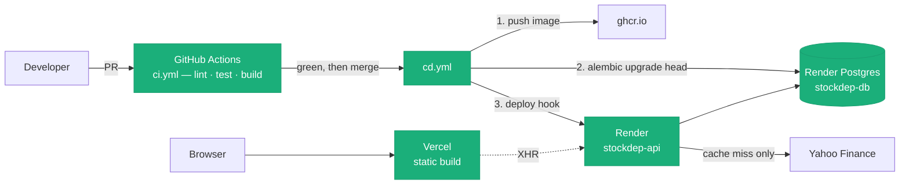
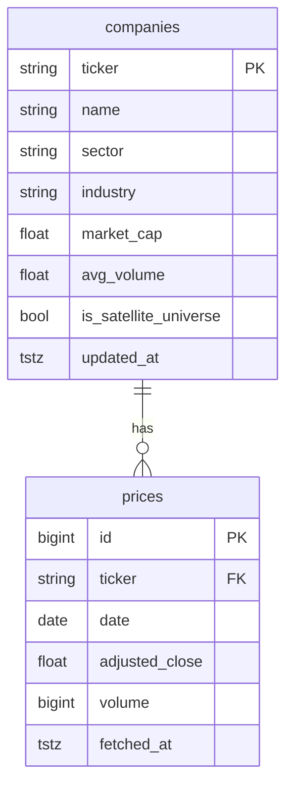

# What Has Been Built — Postgres, CI/CD, Render & Vercel

**Purpose:** a single honest record of how this project went from *"runs on my laptop"* to
*"deployed, durable, and gated by CI."* Written after the fact, verified against the repo
and the live services rather than from memory.

**Companion documents:**
- [next-steps.md](next-steps.md) — where the project goes from here.
- [production-roadmap.md](../prod_roadmap/production-roadmap.md) — the phase-by-phase plan this executed against.
- [target-architecture.md](../prod_roadmap/target-architecture.md) — the end-state design.

> **Reconciled:** August 2026, against `git log`, the filesystem, and the deployed services.

---

## 1. Where the application lives now

| Component | Host | What it is |
|---|---|---|
| **API** | Render (`stockdep-api`) | FastAPI in a Docker container, Python 3.12, non-root. Free plan — spins down when idle. |
| **Database** | Render (`stockdep-db`) | Managed Postgres 16, `basic-256mb`, Oregon. Migrated and backfilled with real data. |
| **Frontend** | Vercel | Vite/React static build on Vercel's CDN. |
| **Images** | `ghcr.io` | Every merge to `main` pushes a SHA-tagged + `latest` image. |
| **CI/CD** | GitHub Actions | `ci.yml` gates PRs, `cd.yml` builds → migrates → deploys on merge. |



The important property of that diagram: **the migration step sits between the build and
the deploy.** New code never starts against an un-migrated schema. Section 4 covers why
that took deliberate work rather than being the default.

---

## 2. The sequence, in the order it actually happened

| Phase | What shipped | Outcome |
|---|---|---|
| **4.6** Hygiene | `ruff`, `mypy`, `pre-commit`, `Makefile` | `make check` green; CI later calls these exact targets |
| **4.7** Containerization | Multi-stage `Dockerfile`, `docker-compose.yml`, `pydantic-settings` config | Runs identically locally and in production |
| **Stage 1 deploy** | `render.yaml` blueprint, `vercel.json` | API + frontend live, but yfinance-backed and ephemeral |
| **Perf fix** | `CorrelationService.prefetch_prices()` | Killed 4 redundant full-universe Yahoo downloads per graph request |
| **4.8** Postgres | SQLAlchemy models, Alembic, two repositories, `deps.py` cutover | Durable storage; cold starts read the DB, not Yahoo |
| **4.9** CI/CD | `ci.yml`, `cd.yml`, branch protection | Every PR gated; every merge deploys safely |
| **Hardening** | Rate limiting; Sentry + frontend tests (PRs open) | Abuse protection and observability |

---

## 3. Postgres (Phase 4.8)

### Why it mattered

Before this, the API's only durable state was a parquet cache on Render's **ephemeral
filesystem** — wiped on every restart, and the free plan restarts often. Each cold start
re-downloaded the entire universe from Yahoo Finance: slow, and a genuine rate-limiting
risk. Postgres turned the cache into something that survives.

### The seam that made it cheap

The repository layer already existed as **`Protocol` interfaces** (`src/repositories/base.py`)
from Phase 4.5. Adding Postgres meant writing two new classes satisfying the same
Protocols — **no service, router, or schema code changed.** The entire cutover is one
conditional:

```python
# src/api/deps.py — the whole Postgres cutover
session_factory = get_session_factory()   # None when DATABASE_URL is unset
if session_factory is not None:
    return PostgresPriceRepository(...)
return YFinancePriceRepository(...)
```

Set `DATABASE_URL` → Postgres. Unset → yfinance + parquet. That property is what makes
local development, CI, and production all work from the same code path, and it's worth
preserving in everything built from here.

### Schema



Two design points worth remembering:

- **`is_satellite_universe`** is a flag, not a separate table — anchors and satellites live
  in one `companies` table, distinguished by the flag. This is deliberate (Phase 7 will set
  the flag from a screener) but it's also the direct cause of a UI quirk: `/api/companies`
  only returns flagged rows, so anchor tickers never appear in search autocomplete. That
  gap is now papered over with a "press Enter anyway" hint in the UI.
- **`fetched_at` / `updated_at`** carry the TTL. A read checks staleness per ticker and
  only hits Yahoo for the stale ones — a *durable cache*, not a new data vendor. Yahoo
  remains the source of truth for prices.

### Bugs hit along the way

Recording these because each was a real lesson, not a typo:

| Problem | Cause | Fix |
|---|---|---|
| `Could not de-stringify annotation 'str \| None'` | SQLAlchemy evaluates `Mapped[...]` annotations **at runtime**; the local venv is Python 3.9 | Use `Optional[X]` in `models.py` only, with a targeted `ruff` per-file-ignore for `UP045` |
| `number of parameters must be between 0 and 65535` | One giant `INSERT` for the whole universe × lookback window blew Postgres's bound-parameter limit | Batch at 2000 rows per statement, all inside one transaction. Regression test added. |
| Tests "passing" against a schema that didn't exist | The pytest fixture does `drop_all()` on teardown against the same local DB Alembic manages, leaving `alembic_version` lying | Accepted friction; documented. Drop `alembic_version` before a manual migration run. |

The parameter-limit one is the most transferable: it only appears at real data volume, and
it is exactly the class of bug a mocked repository test would never catch. That's the
argument for the Postgres tests running against a **real** Postgres, which is why CI spins
up a service container rather than mocking.

---

## 4. CI/CD (Phase 4.9)

### `ci.yml` — on every PR

| Job | What it does |
|---|---|
| `lint` | `make lint-check format-check typecheck` — the identical commands available locally |
| `test` | Spins up `postgres:16`, runs `alembic upgrade head`, then the full suite against it |
| `build` | `docker build` on PRs only — confirms the image still builds |

The `test` job is the one that earns its keep: the 17 Postgres repository tests **skip**
locally when no database is reachable, so without CI they would silently never run.

### `cd.yml` — on merge to `main`

1. Build the image; push to `ghcr.io` tagged with the git SHA and `latest`.
2. `alembic upgrade head` against production (`DATABASE_URL` secret).
3. `curl` Render's **Deploy Hook** — only if step 2 succeeded.

### The non-obvious decision: `autoDeploy: false`

Render's built-in auto-deploy fires the moment it sees a new commit, with **no way to make
it wait** for a migration. Left on, it races `cd.yml` — a deploy could go live against an
old schema. So `render.yaml` sets `autoDeploy: false` and `cd.yml`'s explicit deploy-hook
call became the only thing that puts a build live.

This is the single most important operational property of the setup, and it's invisible
unless you know to look for it. It also replaced the manual migration dance that the free
plan otherwise forces (see §5).

### Friction encountered

- **`mypy` broke in CI while passing locally.** `pyproject.toml` pinned
  `python_version = "3.9"`; the *same* mypy version running under CI's 3.12 interpreter
  refuses to target below 3.10, and then failed parsing numpy's 3.12-only stub syntax.
  Fixed by removing the pin entirely — mypy now infers from the running interpreter, which
  means **CI type-checks against 3.12, the version production actually runs.**
- **Self-approval is impossible.** Enabling "require a pull request" defaults to requiring
  an approval, which a solo maintainer cannot give on their own PR. Resolved by setting
  required approvals to **0** while keeping the PR requirement and the `lint`/`test` status
  checks — the protections that actually have teeth.
- **Pre-commit blocks commits.** A failed hook means the commit *did not happen*. Worth
  checking `git log` rather than assuming.

---

## 5. Render

`render.yaml` is a **Blueprint** — infrastructure as code, reviewable and diffable, rather
than dashboard clicking. It declares the web service and the database together, and wires
`DATABASE_URL` via `fromDatabase` so the connection string is injected at deploy time and
never typed into a form or committed.

### Things that are genuinely confusing about Render

Recorded because they cost real time:

- **Blueprint Sync ≠ Manual Deploy.** Manual Deploy redeploys existing services. Only a
  **Blueprint Sync** creates newly-declared resources or applies changed `render.yaml`
  settings. A database declared in the file simply will not appear until you sync.
- **The Shell tab is a paid feature.** The documented way to run migrations/backfills is
  the Shell. The workaround: use the database's **External Database URL** and run the same
  `alembic` / `python -m src.cli` commands from a local machine. `cd.yml` has since made
  this unnecessary for migrations; only the one-time backfill needed it.
- **Paid resources gate on payment info.** A `basic-256mb` Postgres requires a card on file
  before the Blueprint sync will complete, even though the sync itself looks like a
  configuration action.
- **Two different "Connect" tabs.** The web service's Connect tab shows outbound IPs; the
  *database's* Connect tab has the connection strings. Easy to land on the wrong one.

### Free plan, honestly

The API is on `plan: free`, which spins down after ~15 minutes idle. Post-Postgres this is
much less painful than it was — a cold start now reads warm rows from the database instead
of re-downloading the universe from Yahoo — but the first request after idle is still slow.
`preDeployCommand` (Render's native pre-deploy migration hook) also requires a paid plan;
`cd.yml` covers that instead, and deliberately keeps covering it even if the plan is
upgraded later, so there are never two independent migration triggers.

---

## 6. Vercel

The frontend is a **static build** — no server, no SSR — served from Vercel's CDN. Three
things make it work:

- **SPA rewrite** (`vercel.json`): every path rewrites to `index.html`, so React Router
  deep links like `/anchor/NVDA` survive a hard refresh. Without it, those 404 **in
  production only** — the dev server handles it transparently, so it's invisible locally.
- **Build-time env inlining.** Vite bakes `VITE_API_BASE_URL` into the bundle at build
  time. It is not read at runtime, changing it requires a redeploy, and it must never hold
  a secret — anyone can read it in devtools.
- **Root Directory set to `frontend`** in the Vercel project settings.

Vercel's GitHub App operates completely independently of GitHub Actions: it builds PR
previews and production deploys on its own, regardless of whether `ci.yml` passed. That's
convenient, but it does mean **the frontend currently deploys without a passing test gate**
— see [next-steps.md](next-steps.md).

---

## 7. Hardening

| Item | State | Notes |
|---|---|---|
| **Rate limiting** | ✅ merged | `slowapi`, per-IP. 60/min default; **5/min** on `POST /anchors/{ticker}/refresh` — the one unauthenticated endpoint that triggers a direct Yahoo round-trip. |
| **CORS** | ✅ | `CORS_ALLOWED_ORIGINS` env var, set to the real Vercel origin. |
| **Sentry** | 🟡 PR open | Backend error monitoring, tracing, log forwarding. Gated on `SENTRY_DSN` — unset means never initialized, so local/CI stay silent. Needs `SENTRY_DSN` added in the Render dashboard. |
| **Frontend tests** | 🟡 PR open | Vitest + RTL (7 unit tests) and 2 Playwright smoke tests, from a baseline of zero. |
| **Secrets** | ✅ | `.env` gitignored, `.env.example` committed. GitHub `production` environment holds `DATABASE_URL` + `RENDER_DEPLOY_HOOK_URL` as **secrets** (encrypted, masked in logs), not variables. |

Two testing decisions worth preserving:

- The shared API test fixture **disables the rate limiter**, because `slowapi`'s limiter is
  a module-level singleton and every `TestClient` reports the same address — leaving it on
  would leak 429s across unrelated tests. One dedicated test file re-enables it to exercise
  the real behaviour.
- Vitest's `test.include` is scoped to `src/` so it doesn't try to run Playwright's specs
  under its own runner, and RTL's `afterEach(cleanup)` is wired explicitly because these
  tests import from `vitest` rather than using `globals: true`.

---

## 8. Key decisions and why

| Decision | Rationale |
|---|---|
| Repository `Protocol`s before Postgres | Made the Postgres cutover a one-conditional change instead of a rewrite |
| Postgres as a durable **cache**, not a new vendor | Yahoo stays the source of truth for prices; TTL columns drive refresh |
| `autoDeploy: false` + explicit deploy hook | Guarantees migrate-before-deploy; Render alone cannot |
| Real Postgres in CI, not mocks | The 65535-parameter bug is invisible to a mocked session |
| `mypy` target follows the interpreter | CI checks against 3.12 — what production actually runs |
| Required approvals = 0, PR + status checks on | Real gates for a solo maintainer; approval-by-self is impossible |
| `SENTRY_DSN` / `DATABASE_URL` presence-gated | One code path for local, CI, and production |
| Frontend on Vercel, API on Render | Static CDN for the bundle; container platform for the API |

---

## 9. Known gaps and accepted debt

Honest list, carried into [next-steps.md](next-steps.md):

- **CI does not test the frontend.** `ci.yml` is backend-only; the new Vitest/Playwright
  suites are not wired in, and Vercel deploys regardless of test results.
- **Correlations are computed per request.** Nothing is precomputed or persisted, so a cold
  `/api/graph` does the full analytic stack live. The single biggest remaining
  performance lever.
- **No scheduled jobs.** Data refreshes lazily on request rather than on a daily cadence.
- **The universe is still a hardcoded 55-ticker list** (Phase 7).
- **The backfill is a laptop command**, not a repeatable job.
- **Free-tier cold starts** remain user-visible on first request after idle.
- **No structured logging or request IDs** — logs are human-readable strings.
- **No auth** — deliberate for a read-only public app (Phase 5b).
- **The database password was shared in plaintext during setup and, by explicit decision,
  not rotated.** Recorded as an accepted risk, not an open action.

---

## 10. Operating it — quick runbook

```bash
# Local: full stack (API + Postgres 16)
make up && docker compose exec api alembic upgrade head

# Local: the gate CI enforces
make check                     # lint + format + types + tests

# One-time (or after a schema reset): seed universe + price history
DATABASE_URL="<external-url>" python -m src.cli backfill-postgres

# Frontend
cd frontend && npm run dev / test / test:e2e / build
```

**To ship a change:** branch → PR → `ci.yml` must pass → merge → `cd.yml` builds,
migrates, and deploys automatically. No manual Render step. Direct pushes to `main` are
blocked by branch protection.

**To change the schema:** edit the SQLAlchemy models, `alembic revision --autogenerate`,
review the generated file, commit it. `cd.yml` applies it on merge.
